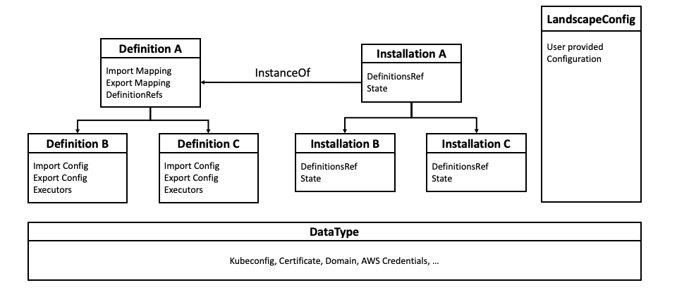

# Entities Overview
The Landscaper's conceptual model is made up of various entities:
- [`ComponentDefinition`](#componentdefinition)
- [`Installation`](#installation)
- [`Execution`](#execution)
- [`DeployItem`](#deployitem)
- [`DataType`](#datatype)

## `ComponentDefinition`
A `ComponentDefinition` ([detailed documentation](Blueprints.md)) is a _building block_ or piece of a functioning Gardener installation.

It describes:
- expected configuration to be able to install/update/manage this component (_Inputs_)
- the generated configuration as an effect of 
- the execution (e.g. helm templates, running a container, etc) that actually installs/updates/manages this component
- (optional) contained/aggregated child `ComponentDefinitions`
- (optional) datatypes definining the format of parts of the configuration

The `ComponentDefinition` resides in an OCI compliant registry. Although it looks like a regular K8s CRD, it is not deployed into any cluster but dynamically fetched from the Landscaper as needed.

## `Installation`
An `Installation` ([detailed documentation](./Installations.md)) references one [`ComponentDefinition`](#ComponentDefinition). It is an _instruction_ to the Landscaper to install the respective component.
It is a CR that is deployed by an administrator into the cluster that hosts the Landscaper.
In addition, the landscaper automatically creates Installation CRs corresponding to aggregated ComponentDefinitions.

## `Execution`
An `Execution` references one [`Installation`](#installation).
It is an internal custom resource created automatically by the Landscaper when it decided that all prerequisites are fulfilled to actually install/update/manage the respective component.
The Landscaper uses this CR to keep track of running installations and distribute the required execution steps upon various controllers responsible for different parts of the installation.

## `DeployItem`
A `DeployItem` references one [`Execution`](#execution). It is an internal custom resource created automatically by the Landscaper and used to describe single steps in a complete `Execution`.
`DeployItems` can encapsulate the description of a helm deployment or a container execution, etc.
The Landscaper uses various controllers that watch for new `DeployItems` and schedule the respective work.

## `DataType`
A `DataType` ([detailed documentation](./DataTypes.md)) defines via OpenAPIv3 the format of a piece of configuration that is either used as an _Input_ or _Output_ in a [`ComponentDefinition`](#ComponentDefinition).