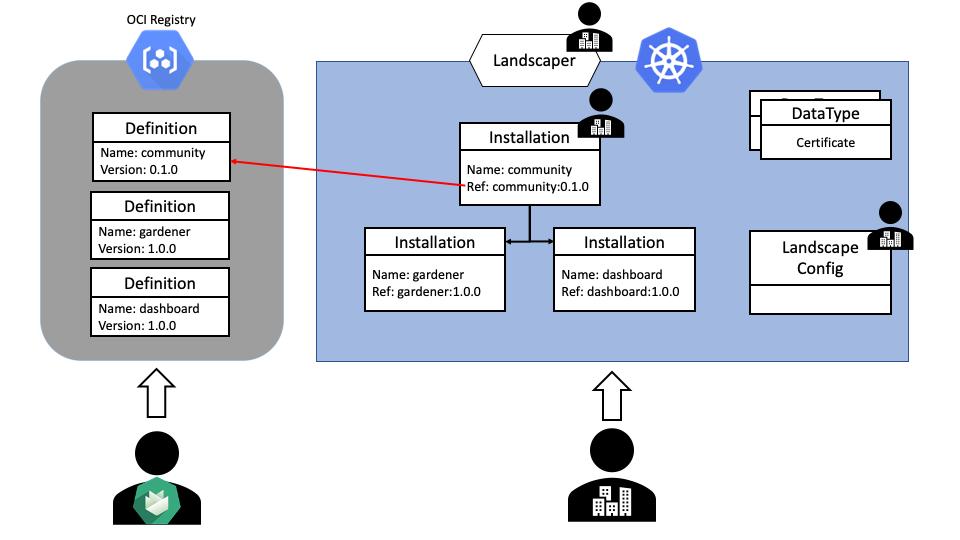
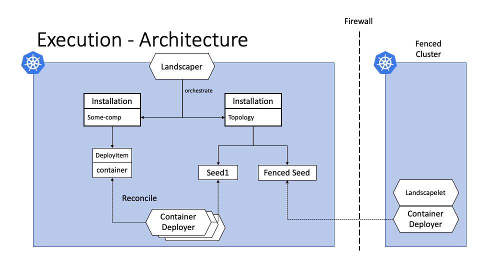

# Landscaper Documentation

The _Landscaper_ is an [operator](https://kubernetes.io/docs/concepts/extend-kubernetes/operator/) to install, update & manage a Gardener deployment.

The landscaper consists of the entities [described here](./Entities.md).

Definitions reside in a OCI registry that include the definition configuration and may also include content.
This content is by default all files that are needed for the deployment like templates, manifest, and more.

All other resources are CRD's that live in a kubernetes cluster and are managed by the landscaper controller.

Installations are instances of definitions with a context specific mapping of their imports the current state.
The landscaper will start recursively deploying the installation, as soon as a installation is pushed the cluster.
Recursively deploy, means that the landscaper will create the included subinstlalaltions and will schedule them according
to the landscaper scheduling algorithm. (The scheduling is described in more detail [here](./Scheduling.md))

The real deployment of components implemented through `DeployItems`.
DeployItems are rendered and scheduled by the landscaper based on the `execution` in the Definition.
They are by itself CRDs that are created inside the landscaper cluster where Deployers 
(controllers that know how to deploy DepoyItems of a specific type) pick them up the deploy/update/delete the specified resources.

