# Concept

The *Landscaper* is a Kubernetes based processing framework that can be used to
control and manage installation and upgrade processes for any environment and
technology. It implements the infrastructure-as-data pattern mapped to the
installation realm.

This is achieved by restricting the core engine to the controlling and management
of state and clearly separating it from the execution of real deployment actions,
which are encapsulated in dedicated deployers following the Kubernetes controller 
approach. The functionality of the deployer is not bound to dedicated
deployment and target technologies, therefore it is possible to manage any 
technical environment and deployment technology by the same control framework,
e.g.:
- _helm_ (deployment technology) deployments on Kubernetes (target environment)
- _terraform_ (deployment technology) deployments for any target environment supported
- Hyper-scaler technologies to manage hyper-scaler environments
- any legacy technology able to manage dedicated environments

Those controllers typically come into life as a result of deployment
actions, which again can be managed by the _Landscaper_. This way a product
installation can extend the deployer set on its own to self-describe its
own required deployment technologies. The _Landscaper_ installation itself can
be kept minimal but is recursively extensible. Because it is Kubernetes based
it just comes with a very limited set of basic Kubernetes deployers.

A core feature of the _Landscaper_ is the management of a data flow (sometimes
also called data pipelining) among
separated installation units, which decouples installation units that only
relate to required data, but do not directly depend on required other
installation units, anymore.

Installation units describe the concrete installation instances with their
configurations and fall back to installation rules, described by so-called 
_Blueprints_ that are provided together with the required
deployment artefacts (e.g. container images or helm charts) as part of software
components stored and delivered via artefact repositories (based on the Open
Component Model).

Together with the possibility to describe and manage deployment targets
to support various technical deployment environments from a single 
_Landscaper_ installation, a complete life-cycle environment for complex
system installations is provided.

The following sections describe the various concepts and elements in more
detail.

**Index**:
- [Concept](#concept)
    - [Landscaper Data Plane](#landscaper-data-plane)
    - [Data-Flow and Installation-Unit-Decoupling](#dataflow-and-installation-unit-decoupling)
    - [Decoupling of Concrete Installations from Installation Descriptions](#decoupling-of-concrete-installations-from-installation-descriptions)
    - [Deploy Items and Deployers](#deploy-items-and-deployers)
    - [Deployers and Deploy Targets](#deployers-and-deploy-targets)
    - [Decoupling of Development and Installation Environments](#decoupling-of-development-and-installation-environments)
    - [Blueprints and DeployItems](#blueprints-and-deployitems)
    - [The Complete Picture](#the-complete-picture)

### Landscaper Data Plane

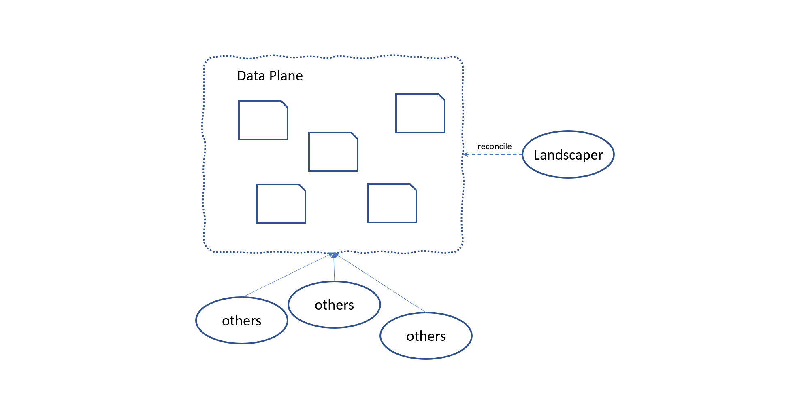

The _Landscaper_ is a set of Kubernetes controllers working on a Kubernetes
data plane hosting the resources manged by the landscaper. As such it may live
in a Kubernetes cluster and use the data plane of the runtime cluster, or is uses
its own data plane consisting of a nodeless Kubernetes data plane 
(Kubernetes api server plus etcd and stripped controller manager). The latter
is highly recommended to grant access to the landscaper data plane to be
able to configure installations without the possibility to access the
runtime cluster the landscaper tools are running in.

The following sections will introduce the basic concepts behind the _Landscaper_,
the landscaper resources living in the data plane resulting from these concepts
and their relation to each other.

### Dataflow and Installation-Unit-Decoupling

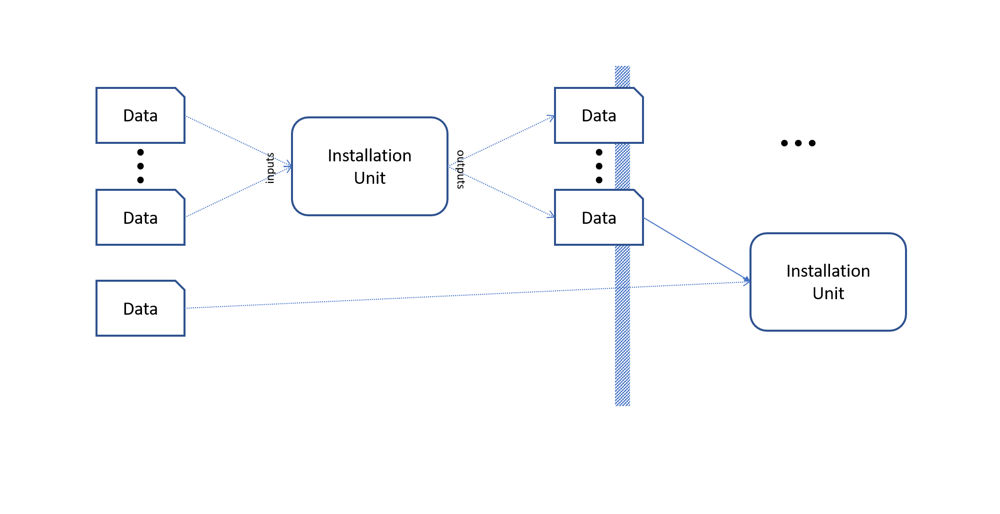

Installation units do not declare dependencies to other installations units,
directly. Instead, they request dedicated configuration data of an optionally
verified structure, regardless of the provider of this data. This is described
by the definition of _Inputs_ that import sets of configuration data,
or even single values, from _DataObjects_ that are the containers for any
structured data. Those data objects are dedicated resources in the _Landscaper_.
On the other side an installation can offer data as result of an installation
process as _Outputs_ and feed the provided data to other data objects.

For example, an installation unit installing a stateless web application could
require access to a database in a certain way. This is expressed by
requesting input data, a configuration describing the access to a database.
This input just describes the data required, not the source providing this data.

A second installation unit provides a database installation. It provides
access information to use this database instance, which is then
provisioned to a dedicated data object, that will be consumed by the
installation unit handling the application installation.

The provisioning and the consumption of this data object then
connects both installations in this concrete scenario and finally
establishes a dependency between them.

Although both installations are interconnected in this scenario they don't
need to know each other. This way the same installation unit can
be used in completely different scenarios, as long as the required configuration
data is provided. The result are reusable and freely combinable installation
units.

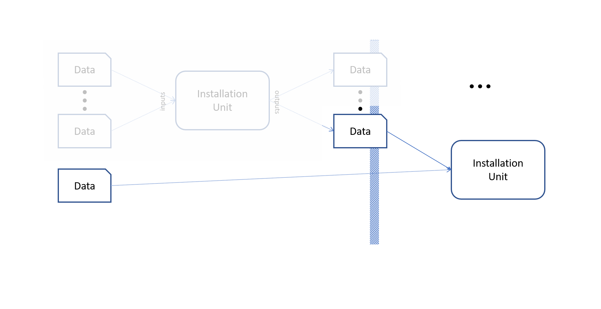

For example, the previous installation unit handling the application installation
can be used with an explicitly configured data object, hosting the database access
information without an explicit database installation handled by the
_Landscaper_ environment.

The examples shown above just illustrate a basic data usage. In real scenarios
data might be mapped and combined by installation units as part of the
installation unit to meet structural requirements.

### Decoupling of Concrete Installations from Installation Descriptions

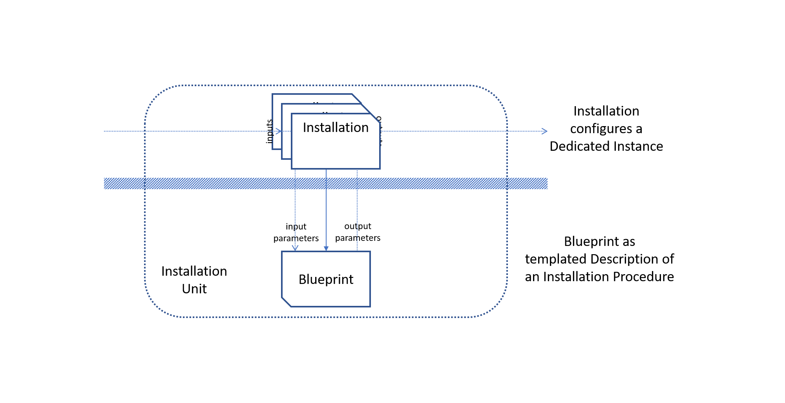

An installation unit consists of two different parts. There may be multiple
_Installation_ objects in the _Landscaper_ that reflect dedicated installation
instances with the necessary inputs and outputs.

Every installation refers to a shared _Blueprint_ that contains the state handling
logic. The _Blueprint_ is no object in the _Landscaper_ data plane but a deployment
artefact, like container images or helm charts. It is provided together
with the installable entities as content of an artefact repository and described
by a component version according to the _Open Component Model_.

The blueprint defines statically typed input and output parameters. The task of the
installation is to map data object inputs to concrete values for input parameters
for a dedicated blueprint execution and vice versa to map provided output values of
the blueprint execution to exported data objects.

The task of the blueprint then is to generate deployment information based on the
input and its own data and to provide its output based on the deployment state/result.

This separation basically supports a decoupling of the operational realm consisting
of the management of installations in a concrete installation scenario from the
development realm providing the installation descriptions in form of blueprints
and  the required deployment artefacts.

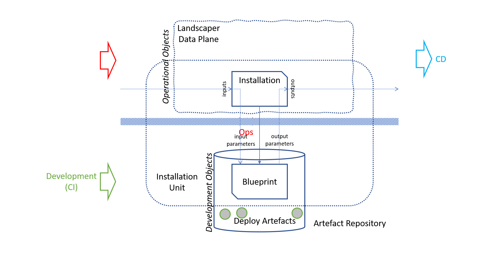

While the artefact repository is fed from development or delivery pipelines,
the set of installations and their wiring for a concrete installation scenario
can be handled by git-ops tooling. The concrete deploy steps and actions are
then generically managed by the _Landscaper_ based on the configured installations
and the content provided in the artefact repositories.

### Deploy Items and Deployers

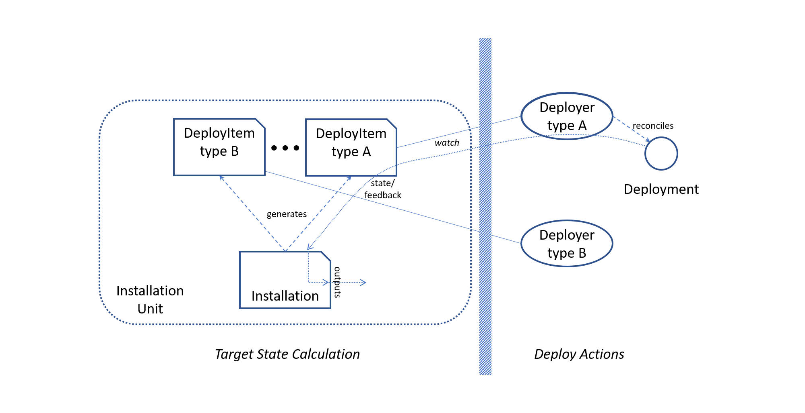

An installation unit does not execute concrete deploy action on its own.
Its task is to produce so-called _DeployItems_. A _DeployItem_ describes
the target state of a dedicated deployment step. It is a dedicated resource
in the _Landscaper_ data plane that formally defines a contract between the
installation processing and _Deployers_ that finally are responsible to
execute dedicated possibly ongoing deployment actions in a dedicated target
environment.

Deploy items are formally typed, meaning they describe a dedicated kind
of deployment handling, for example, a helm deployment, a terraform deployment
or any other special kind of _deployment technology_. The payload of
a _DeployItem_ is a deployment (target state) description, whose format
is defined by the _DeployItem_ type. For example, for a helm deployment
a helm chart reference and concrete values are described.

A Deployer is a Kubernetes controller that is always responsible for a dedicated
_DeployItem_ type. It watches for items it is responsible for and executes 
the necessary tasks required to achieve the described state in a
target environment. Additionally, it may provide feedback about the state
of the deployment as formally export fields in the _DeployItem_, which then
is handed over by the _Landscaper_ to the output processing of an installation
unit.

Deployers can, for sure, again be matter of deployment of other deploy items.
This way any complex deployment environment can be bootstrapped
from a very simple initial landscaper deployment.

There are various scenarios how deployers can be assigned to dedicated target
environments. This is described in the next section.

### Deployers and Deploy Targets

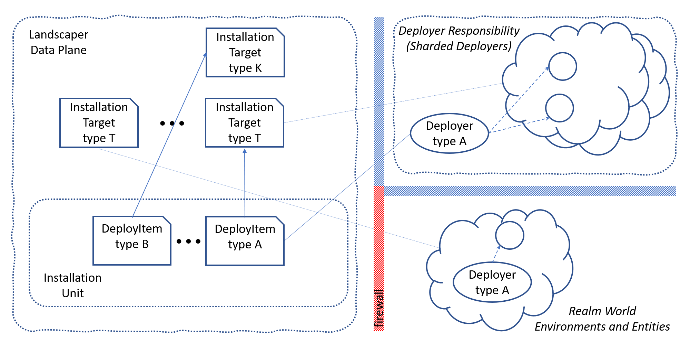

In a simple scenario a single deployer managing a single deploy environment,
e.g. a Kubernetes cluster, might be sufficient. But typically, in more complex 
scenarios, there might be a bunch of different deployment targets with completely
different types.

This is supported by the _Landscaper_ by introducing an _InstallationTarget_.
Like a _DeployItem_ it has a dedicated type, for example Kubernetes cluster.
It describes a dedicated instance of a deployment environment, this might be a
Kubernetes cluster, IAAS Account, a software instance that accepts configuration
items, or any kind of environment or technology that is applicable to accept some kind
of configuration request handed over by a deployer.

Its task is to provide the identity of the target environment and optionally further
attributes, like an environment version or even access information.
For a Kubernetes cluster, this could, for example, be the api server url and 
a service account token. But these are optional elements that depend on the
interaction of deployers with their targets.

This way a dedicated instance of a deployer can be responsible for a dedicated
set of target environments. There might even be a dedicated instance of a
deployer for a dedicated environment, for example a helm deployer running
in the Kubernetes cluster it is responsible for. In such cases the access
information to the target may be matter of the deployer deployment and must not
necessarily be part of the _Installation Target_ object.

Every _DeployItem_ now describes the installation target it should be deployed on.
A deployer then selects to handle those deploy items it is responsible for, 
depending on the type of the item and the described installation target.

According to the Kubernetes controller pattern the deployers may be sharded
in any way according to the needs of the structure of the target landscape.
This sharding might even dynamically established by target environments 
and deployer installations dynamically created by other deployers and deploy
items.

The only constraint for deployers is that they have to be able to establish
a connection to the _Landscaper_ data plane. This way they may even live behind
firewalls and enable the deployment of software to hidden or fenced environments
controlled by a central landscaper installation.

### Decoupling of Development and Installation Environments

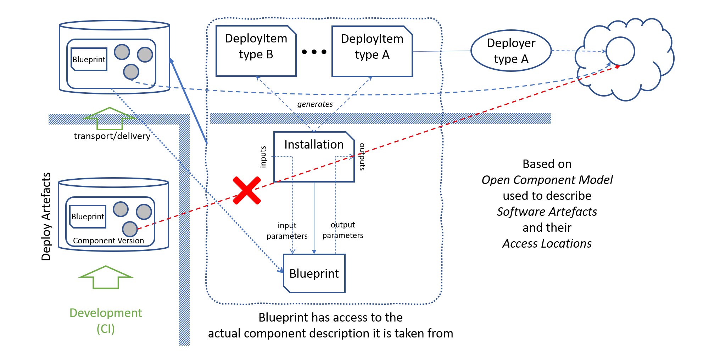

A typical scenario the _Landscaper_ is used, is maintaining a deployment
landscape managed and operated by development teams. Here the development
activities provide the deployment artefacts in a local artefact repository
which is used to feed a local landscaper installation by git-ops tooling.

In such a scenario the artefacts that are finally deployed, for example container
images can directly be consumed from the artefact repositories they
are published to from the development processes.

As a consequence typical deployment environments rely on globally accessible
artefacts and deployment descriptions, Or even programs and container images that
again  deploy things on their behalf incorporated fixed locations.
An example here may be a helm chart that contains templates using fixed
image locations.

Such installation environments will never be deliverable into dedicated
separated or even fenced environments with an own repository landscape.

The _Landscaper_ is designed to also be usable for such scenarios. To
support using software artefacts that have been transported into dedicated
local artefact repositories the used addresses of artefacts to be deployed
must be adapted to the actually used installation environment.

This is the domain of the _Open Component Model_. It is designed to describe
software component(version)s as sets of technical artefacts including access
scheme to address an artefact. This addressing has been formalized and clearly
separated from the content description, enabling signing component versions
without these addressing schemes. This is the basis for a generic transport
and delivery environment, that is able to transport software component per value,
not only copying the aggregation description, but also the described content.

Thereby the new address information is replacing the original one. As a result,
in a target environment fed by this tooling, the component version description
now refers to the actual locations of the described artefacts.

The _Landscaper_ supports this component model to access used resources, like
the installation descriptions itself.

The existence of a component description is part of the rendering model
for _DeployItems_. It must describe all artefacts required by the installation process.
So, the rule execution in blueprints has access to
the actually used software description it is taken from and is therefore
able to incorporate actual artefact addresses in the rendered _DeployItems_.

**This is now a fundamental contract for all deployments: all required
externally addressed software artefacts must be parameterized and the task
of the installation process is to take the actual address from the actually
used component version description.**

### Blueprints and DeployItems

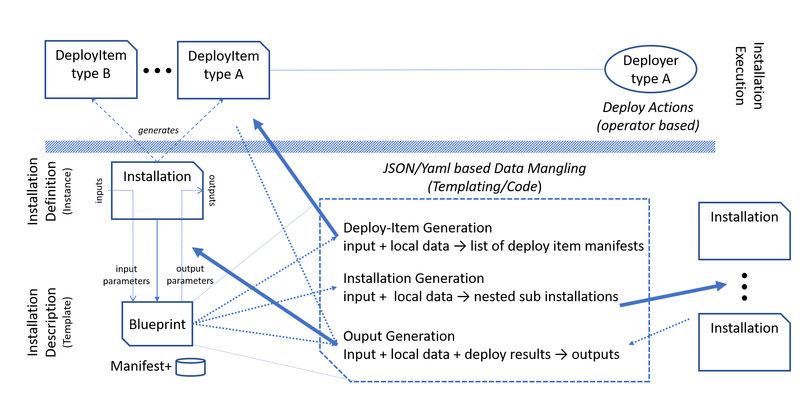

_Blueprints_ are basically templates for the generation of _DeployItems_ on behalf
of a concrete installation. As such it declares input parameters.
When a _Blueprint_ is instantiated on behalf of an _Installation_ 
several data processing steps executed that mangle actual input data with templates
to generate deploy descriptions:

- _DeployItem_ templates are processed to render a set of _DeployItems_ with their
 dependencies. The _DeployItems_ are then put into the landscaper data plane
 and are processed by the deployers feeling responsible for them.
- _Installation_ templates are used to render a set of nested installations
  with an own naming scope for the installations and the connecting data objects.
- _Output_ templates used to render the values for the formal output field
 of a blueprint based on the input value and the state and export information 
 of the rendered _DeployItems_. This is done whenever the state of the rendered
 _DeployItems_ is not failed. The rendered outputs are then passed to the
 installation which updates its data objects

The complete processing just includes manifest mangling done in standardized
way by the _Landscaper_. It is completely independent of the type of the
intended target environments and deployment technologies. The concrete deployment
actions, and therefore the technology specific tasks, are completely encapsulated
in the deployers.

### The Complete Picture

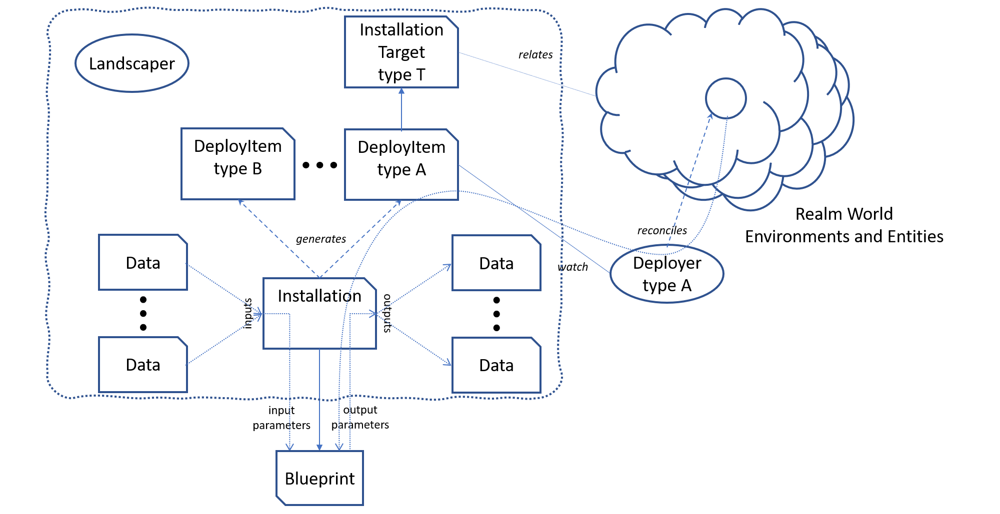

The _Landscaper_ operates on resources stored in a Kubernetes data plane.
The central element is the _Installation_. This  element describes
the installation of a dedicated instance of a deployable component.

An _Installation_ is fed by configuration data, represented by _DataObjects_ 
in the data plane. _DataObjects_ may be explicitly maintained configuration objects,
or they are generated by other _Installations_. This is possible, because any
_Installation_ may yield outputs intended to be consumed by other _Installations_.

The _Installation_ refers to a dedicated kind of software artefact called _Blueprint_.
It is a software artefact like container images or helm charts, that are
maintained as part of the development process and provided together with the
other deployment artefacts. A _Blueprint_ is some kind of template with
input and output parameters that are fed (and consumed) by dedicated
_Installation_ instances and generically evaluated by the _Landscaper_.

The task of a _Blueprint_ is to describe the rendering of _DeployItems_
that describe target state for dedicated types of deployment elements.
The deployments described by those items are bound to dedicated
deployment technologies, for example helm charts, or terraform deployments.

The implementation of those deployment technologies is encapsulated into
dedicated active elements, the _Deployers_. _Deployers_ act according
to the Kubernetes controller pattern and are responsible to achieve the
target state described by the _DeployItem_ in a dedicated target environment.

---

_This setup so far, up to some degree, can be compared to a computer program,
the _Blueprints_ are procedure definitions with formal parameters and the
_Installations_ are procedure calls providing dedicated values for
the called procedures. The _DataObjects_ are variables and the
data mapping possible in _Installations_ is the glue code in form of simple
expressions for implementing the data flow among the procedure calls.
The _Blueprints_ basically describe executable code blocks that are
asynchronuously executed by the _Deployers_ in form of remote procedure calls.
And finally, the _Landscaper_ is the processor executing the program.
The similarities reach their limits when considering the reconcilation feature
that enables this program to restart at any point in-between, if something
changes._

---

Like _DeployItems_ target environment technologies are completely transparent
for the _Landscaper_. All this is completely encapsulated into the _Deployers_.
But the _DeployItems_ describe a formally defined contract for the interaction
of the _Deployers_ and the _Blueprints_.

To be able to handle more than one instance of a dedicated kind of target
environment, for example a Kubernetes cluster, the _Landscaper_ data plane
uses _Target_ objects to formally describe dedicated environment instances.
Like _DeployItems_ _Targets_ have a dedicated type and are referenced by
the _DeployItems_ to specify the intended environment, the _DeployItem_ has to
be deployed to. Therefore, _Deployers_ are typically sharded and always
responsible to handle _DeployItems_ of a dedicated kind intended for a dedicated
(sub)set of appropriate target environments. There may be any number of _Deployers_
responsible for the same kind of _DeployItem_ and _Target_ as long as
the target sets are not overlapping.

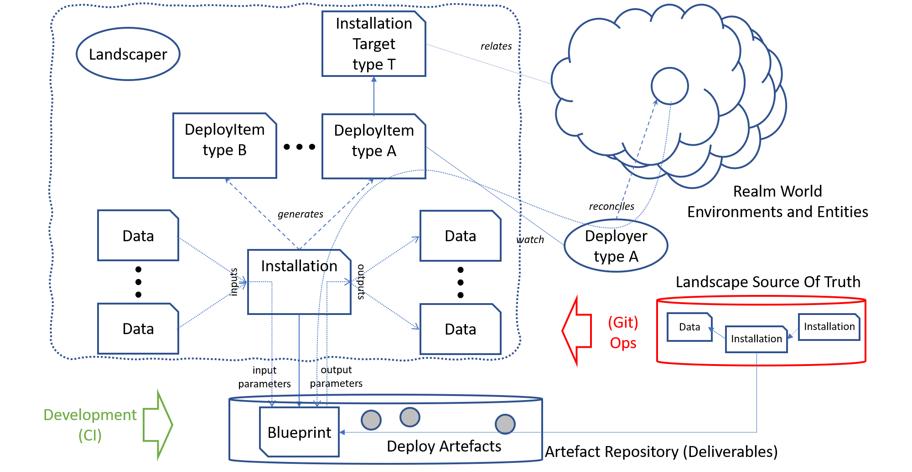

The _Landscaper_ is typically embedded in continuous deployment scenarios
controlled by git-ops methods. The artefacts are provided via development
methodologies or delivery processes in (a set of) artefact repositories.
the _Blueprints_ used by the _Landscaper_ are deployment artefacts like
container images or helm charts amd appropriately versioned.

For operating a dedicated landscape git-ops methodologies can be used by
describing the desired state of a landscape by a set of (interconnected)
 _Installations_ and initial configuration data in form of
_DataObjects_ or even _ConfigMaps_ or _Secrets_. The _Installations_
refer to a dedicated component version stored in the artefact repository
containing the desired deployment artefacts and _Blueprints_.

These elements are then deployed by continuous delivery tools like _Flux_ 
or _ArgoCD_ into a _Landscaper_ data plane. All the rest is done
be the _Landscaper_.
