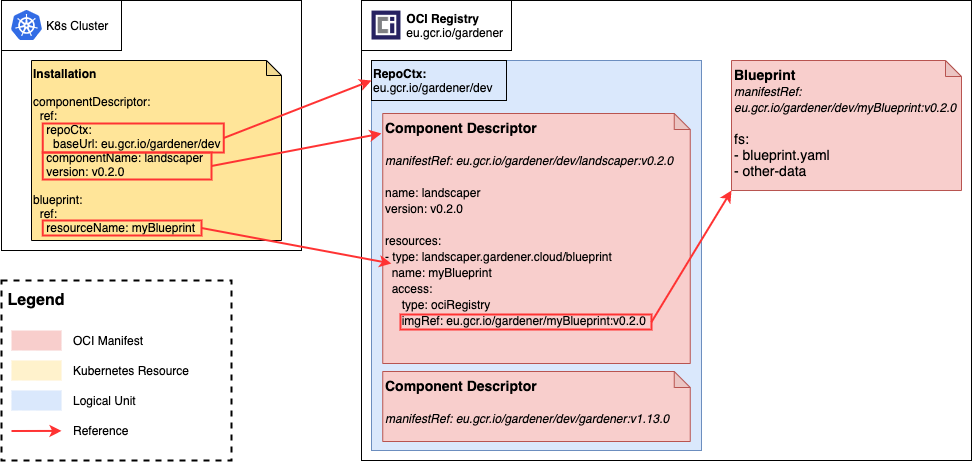
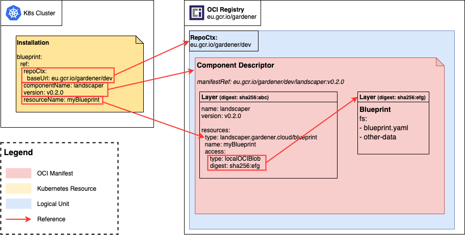
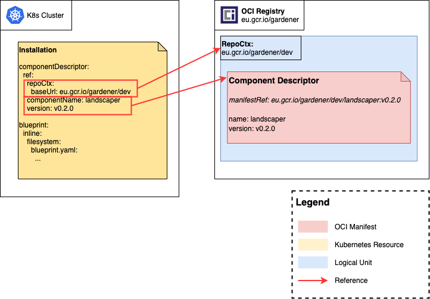

# Installation-Blueprint Relationship

This document describes the relationship between _Installations_, _Component-Descriptors_ and _Blueprints_.

Installations can reference blueprints in 2 different ways:

1. by a [component-descriptor reference](#componentdescriptor-reference)
2. by providing the blueprint [inline](#inline)

See the [installation docs](../usage/Installations.md#blueprint) for a detailed description of the resources.

## ComponentDescriptor reference

Blueprints are artifacts created during the build of a component. As such, they are included as a resource in a component's _Component-Descriptor_. 

In context of Landscaper, Blueprints (referenced in the Component-Descriptor as resource) can be referred to by specifying a Component-Descriptor and the resource within that points to the Blueprint.

Component-Descriptors are uniquely defined by the combination of the repository context they got pushed to, their name and their version. Within the Component-Descriptor, the Blueprint resource can be identified by its name (:warning: see the component descriptor model for a detailed description about a resource's identity).

```yaml
meta:
  schemaVersion: v2

component:
  name: github.com/gardener/landscaper/example
  version: v1.0.0

  [...]

  resources:
  - type: blueprint
    name: example-blueprint
    version: v1.0.0
    [...]
```

In this sample snippet of a Component-Descriptor, the Blueprint would be referred to by the respository context, the component name (i.e. `github.com/gardener/landscaper/example`), its version (i.e. `v1.0.0`) and the name of the Blueprint resource (i.e. `example-blueprint`).

### Access types

Every resource in a Component-Descriptor contains an `access` attribute that describes how the actual artifact - and thus the Blueprint - can be retrieved.

Currently, Landscaper supports two types of access:

#### 1. Artifact Reference

The Blueprint is described as its own OCI artifact and therefore is referred to by a fully qualified OCI artifact reference. The OCI manifest (the actual resource that describes an OCI artifact) contains the blueprint as first layer.



The OCI manifest of the Blueprint in this case would look like this:

```json
{
 "mediaType": "application/vnd.docker.distribution.manifest.v2+json",
 "schemaVersion": 2,
 "layers": [
   {
     "digest": "sha256:efg",
     "mediaType": "application/tar+gz"
   }
 ]
}
```

Then the Blueprint resource in the Component-Descriptor would look like this:

```yaml
# blueprint resource within the component-descriptor
resources:
- name: myBlueprint
  type: landscaper.gardener.cloud/blueprint
  access:
    type: ociRegistry
    imageReference: eu.gcr.io/gardener/myBlueprint:v0.2.0
```

#### 2. Local OCI blob

The Blueprint is part of the Component-Descriptor's manifest on a seperate layer and is referenced by it's digest in the context of its Component-Descriptor.



The OCI manifest of the Component-Descriptor for example would look like this:

```json
{
 "mediaType": "application/vnd.docker.distribution.manifest.v2+json",
 "schemaVersion": 2,
 "config": {
   "digest": "sha256:a123",
   "mediaType": "application/vnd.gardener.cloud.cnudie.component.config.v1+json"
 },
 "layers": [
   {
     "digest": "sha256:abc",
     "mediaType": "application/vnd.gardener.cloud.cnudie.component-descriptor.v2+json"
   },
   {
     "digest": "sha256:efg",
     "mediaType": "application/vnd.gardener.landscaper.blueprint.v1+tar+gzip"
   }
 ]
}
```

Then the Blueprint resource in the Component-Descriptor would look like this:

```yaml
# blueprint resource within the component-descriptor
resources:
- name: myBlueprint
  type: landscaper.gardener.cloud/blueprint
  access:
    type: localOCIBlob
    digest: sha256:efg
```

#### 3. Inline Blueprints

Blueprints can be also directly defined in the manifest of an installation. This can be useful for ad-hoc installations or for quick tests.

A component descriptor is optional for inline Blueprints, but can be used by specifying a component reference through `.spec.componentDescriptor.ref`. If a Component-Descriptor is referenced by an inline Blueprint, it will be  accessible the same way as if it were defined through a non-inline Blueprint.



## Inline Component-Descriptors - for local testing only

To support a local development scenario and to enable easy testing of changes, the Component-Descriptor can be directly declared inline in an Installation resource as well.

```yaml
apiVersion: landscaper.gardener.cloud/v1alpha1
kind: Installation
metadata:
  ...
spec:
  componentDescriptor:
    inline:
      # full component descriptor spec goes here
  ...
```

Any artefacts described by an inline component descriptor has to be available at their specified location (e.g. as an inline Blueprint or in an OCI registry).
