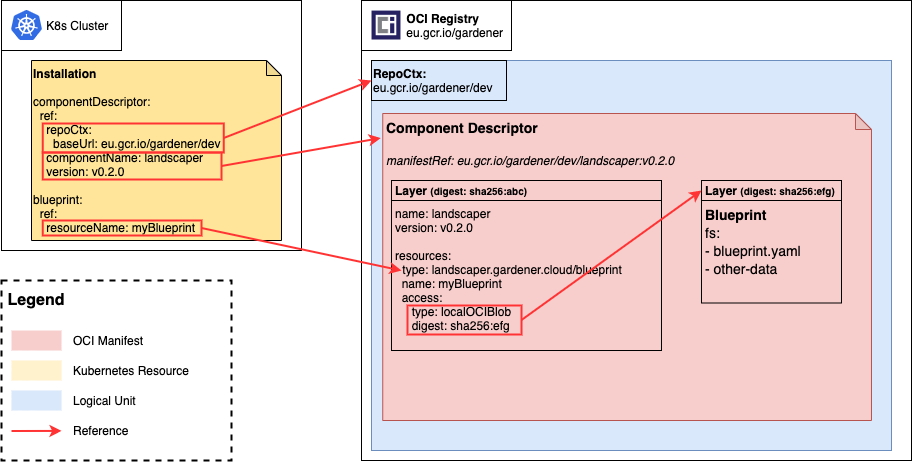

# Installation-Blueprint relationship

This document describes the relationship between installations, component-descriptors and blueprints.

Installations can reference blueprints in 2 different ways
1. By [component-descriptor reference](#componentdescriptor-reference)
2. [inline](#inline)

See the [installation docs](../usage/Installations.md#blueprint) for detailed description of the resources.

### ComponentDescriptor reference

Blueprints are created during the build of a component which implies that they are build artifacts that are part of the component's component-descriptor.

In the landscaper, these blueprints (referenced in the component descriptor as resource) can be referenced by specifying the component-descriptor and the resource inside the component descriptor.<br>
Component descriptors are uniquely defined by the repository context where they are stored and their name and version.
Within the component descriptor, the blueprint resource can be identified by its name (:warning: see the component descriptor model for a detailed description about a resource's identity).

This leads to a blueprint reference that consists of a reference to the component-descriptor (`repositoryContext` + `component name` + `component version`).

The previous described reference points to a component-descriptor resource that describes the build artifact.
Part of that resource is the `access` attribute that describes how the actual blueprint artifact can be retrieved.<br>
Currently the landscaper supports 2 types of access:
#### 1. artifact reference
The blueprint is described as own oci artifact and therefore is described by fully qualified oci artifact reference. The oci manifest (the actual resource that describes an oci artifact) contains the blueprint as first layer:
```json
{
 "mediaType": "application/vnd.docker.distribution.manifest.v2+json",
 "schemaVersion": 2,
 "layers": [
   {
     "digest": "sha256:efg",
     "mediaType": "application/tar+gz"
   }
 ]
}
```
```yaml
# blueprint resource
name: myBlueprint
type: landscaper.gardener.cloud/blueprint
access:
 type: ociRegistry
 imageReference: eu.gcr.io/gardener/myBlueprint:v0.2.0
```


#### 2. local oci blob
The blueprint is part of the component-descriptor's manifest and reference by it's digest in context of the component-descriptor:
```json
{
 "mediaType": "application/vnd.docker.distribution.manifest.v2+json",
 "schemaVersion": 2,
 "config": {
   "digest": "sha256:a123",
   "mediaType": "application/vnd.gardener.cloud.cnudie.component.config.v1+json"
 },
 "layers": [
   {
     "digest": "sha256:abc",
     "mediaType": "application/vnd.gardener.cloud.cnudie.component-descriptor.v2+json"
   },
   {
     "digest": "sha256:efg",
     "mediaType": "application/vnd.gardener.landscaper.blueprint.v1+tar+gzip"
   }
 ]
}
```

```yaml
# blueprint resource
name: myBlueprint
type: landscaper.gardener.cloud/blueprint
access:
 type: localOCIBlob
 digest: sha256:efg
```



### Inline

Blueprints can be also directly defined in the manifest of an installation.
This can be useful for ad-hoc installations or quick tests.

A component descriptor is optional for inline blueprints, but can be used by specifying a component reference `cdRef`.
If a component descriptor is referenced for a inline blueprint, the component descriptor is accessible the same way as if would be defined as blueprint refernece.

