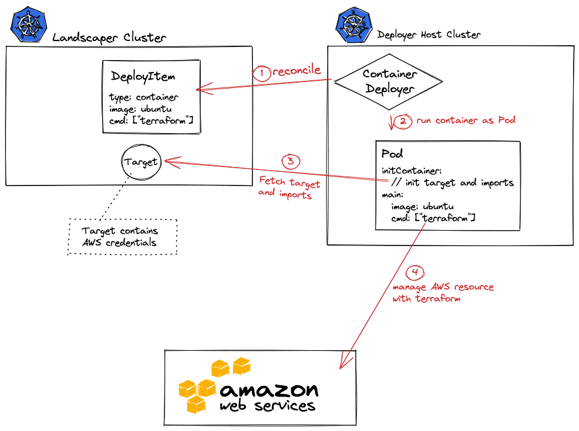
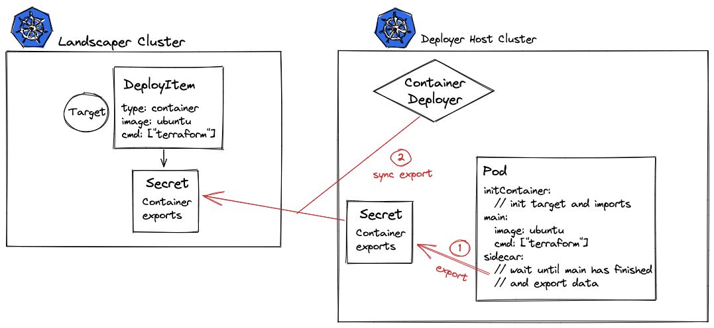
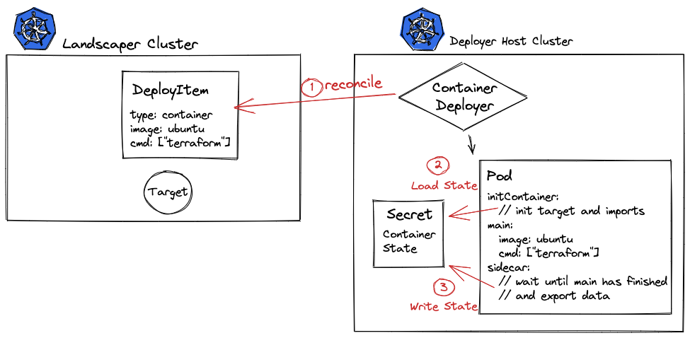

# Container Deployer

The container deployer is a controller that allows you to run whatever coding you need to set up your cloud environment.
You just need to provide your program as a container image which is then executed by Landscaper in combination
with the container deployer.

Your image is provided as a reference in a DeployItem of type `landscaper.gardener.cloud/container`. The DeployItem 
itself must be embedded in a Blueprint and specifies the input data required by your program. Landscaper in
combination with the container deployer provides these input data during runtime. The output or export data of
your program must be stored in a predefined file and are collected by Landscaper/container deployer once your 
program and thus the container terminates.

More details and examples about how to create a component with a blueprint containing a DeployItem for the container 
deployer could be found [here](https://github.com/gardener/landscapercli/blob/master/docs/commands/container_deployer/add_container_di.md). 

**Index**:
- [Provider Configuration](#provider-configuration)
- [Provider Status](#status)
- [Deployer Configuration](#deployer-configuration)
- [Architecture](#architecture)

### Provider Configuration

This section describes the provider specific configuration for a container DeployItem:

```yaml
apiVersion: landscaper.gardener.cloud/v1alpha1
kind: DeployItem
metadata:
  name: my-custom-container
spec:
  type: landscaper.gardener.cloud/container

  target: # has to be of type landscaper.gardener.cloud/kubernetes-cluster
    name: my-cluster
    namespace: test

  config:
    apiVersion: container.deployer.landscaper.gardener.cloud/v1alpha1
    kind: ProviderConfiguration

    componentDescriptor:
#     inline: # define an inline component descriptor instead of referencing a remote
      ref:
        componentName: example.com/my-comp
        version: v0.1.2
        repositoryContext: <abc...>

    blueprint: 
#      inline: # define inline Blueprint instead of referencing a remote
      ref: 
        resourceName: <abc....>
    
    importValues: 
      {{ toJson . | indent 6 }}

    image: <image ref>
    command: ["my command"]
    args:  ["--flag1", "my arg"]
```

### Contract

When the image with your program is executed, it gets access to particular information via env variables: 

- The current operation that the image should execute is defined by the env var `OPERATION` which can be `RECONCILE` or `DELETE`.
  `RECONCILE` means that the program should just execute its usual installation whereby `DELETE` signals that the
  corresponding DeployItem was deleted and some optional cleanup could be done.
- *Imports* are provided as a json file at the path given by the env var `IMPORTS_PATH`.
- *Exports* should be written to a json or yaml file at the path given by the env var `EXPORTS_PATH`.
- An optional *state* should be written to the directory given by the env var `STATE_PATH`. The complete state 
  directory will be tarred and managed by Landscaper(:warning: no symlinks). The last state data are provided 
  in the next execution or your program. 
- If *componentDescriptor* is specified in the DeployItem, the *Component Descriptor* can be expected as a json file at 
  the path given by the env var `COMPONENT_DESCRIPTOR_PATH`. The json file contains a resolved component descriptor list 
  which means that all transitive component descriptors are included in a list.

  ```json
  {
    "meta":{
      "schemaVersion": "v2"
    },
    "components": [
      {
        "meta":{
          "schemaVersion": "v2"
        },
        "component": {}
      }
      ...
    ]
  }
  ```

- If *componentDescriptor* and *blueprint* is specified, a *content blob* can be accessed at the directory given by 
  the env var `CONTENT_PATH`. The *content blob* consists of all data stored in the blueprint, consisting of the blueprint 
  yaml file and all other files and folders you stored together with this.
- The container is not executed as root user due to security reasons.
  Instead, the following user/group is used (see the [Kubernetes Documentation](https://kubernetes.io/docs/tasks/configure-pod-container/security-context/#set-the-security-context-for-a-pod) for details):
  - **User**: 1000
  - **Group**: 3000
  - **FSGroup**: 2000
  
Again you will find a more detailed explanation of these env variables
[here](https://github.com/gardener/landscapercli/blob/master/docs/commands/container_deployer/add_container_di.md).

### Status

This section describes the provider specific status of the resource.

```yaml
status:
  providerStatus:
    apiVersion: container.deployer.landscaper.gardener.cloud
    kind: ProviderStatus
    # A human readable message indicating details about why the pod is in this condition.
    message: string
    # A brief CamelCase message indicating details about why the pod is in this state.
    # e.g. 'Evicted'
    reason: string
    # Details about the container's current condition.
    state: corev1.ContainerState
    # The image the container is running.
    image: string
    # ImageID of the container's image.
    imageID: string
```

### Operations

In addition to the annotations that are specified in the DeployItem contract (operation reconcile and force-reconcile), 
the container deployer implements specific annotations that can be set to instruct the container deployer to 
perform specific actions.

- _container.deployer.landscaper.gardener.cloud/force-cleanup=true_ : triggers the force deletion of the deploy item. 
  Force deletion means that the delete container is skipped and all other resources are cleaned up. 
  
## Deployer Configuration

When deploying the container deployer controller it can be configured using the `--config` flag and providing a configuration file.

The structure of the provided configuration file is defined as follows.

:warning: Keep in mind that when deploying with the helm chart the configuration is abstracted using the helm values. See the [helm values file](../../charts/container-deployer/values.yaml) for details when deploying with the helm chart.
```yaml
apiVersion: container.deployer.landscaper.gardener.cloud/v1alpha1
kind: Configuration
namespace: "default" # namespace on the host cluster where the pods should be executed
initContainer:
  # image that should be used as init container
  # this options should only be used for development purposes.
  # it defaults to the landscaper shipped images.
  image: "someimage"
  command: ""
  args: ""
  imagePullPolicy: IfNotPresent
waitContainer:
  # image that should be used as wait container
  # this options should only be used for development purposes.
  # it defaults to the landscaper shipped images.
  image: "someimage"
  command: ""
  args: ""
  imagePullPolicy: IfNotPresent
defaultImage:
  # default image that is used if the provider configuration does not specify a image.
  image: "someimage"
  command: ""
  args: ""
  imagePullPolicy: IfNotPresent
oci:
  # allow plain http connections to the oci registry.
  # Use with care as the default docker registry does not serve http with any authentication
  allowPlainHttp: false
  # skip the tls validation
  insecureSkipVerify: false
  # path to docker compatible auth configuration files.
#  configFiles:
#  - "somepath"

# target selector to only react on specific deploy items.
# see the common config in "./README.md" for detailed documentation.
targetSelector:
  annotations: []
  labels: []

debug:
  # keep the pod and do not delete it after it finishes.
  keepPod: false
```

## Architecture

### Reconcile
The container deployer is a Landscaper deployer that can execute arbitrary containers.
The deployer itself is Kubernetes controller that runs inside a kubernetes cluster.
This cluster can be same as the Landscaper Cluster but does not have to. 
In the example this execution cluster is called `Deployer Host Cluster`.

As the deployer already inside a Kubernetes cluster that is able to execute containers, this cluster is used to execute the container specified in the DeployItems ProviderConfig.
The containers are not executed in the `Landscaper Cluster` as this cluster might not be able to execute containers (virtual/nodeless cluster).
And with that approach, it is possible to run the container deployer in a fenced environment and access apis/resources that are not accessible from the Landscaper cluster.
As for the other container, the target is used to determine the responsible container deployer.
> Note: The target does not need to be a kubernetes cluster target. And the container deployer does not execute the container in the target cluster. It always executes it in its host cluster (although that host cluster is configurable).

When a Container DeployItem is reconciled basically the following steps are performed:
1. The Container Deployer watches the DeployItem
2. When the DeployItem is ready to be executed (configuration has changed), the container deployer schedules a Pod.
3. That pod contains a InitContainer that fetches the targets, import values, blueprint and the resolved component descriptor. The data is stored in a shared local volume.
4. The actual application code is executed in a main container as soon as the initContainer has finished. The main container has access to the shared volume which make it possible for the application to access runtime data and configuration.
5. When the main container has successfully finished, optionally data is exported. See [Container Eexport](#export) for detailed export architecture.



#### Export

When the main container in a pod execution of the Container Deployer has been successfully completed. Optionally data can be exported and made available to other deployitems/installation in the cluster.

The export process looks as follows:
0. The data to be exported is written to shared volume
1. The shared volume is also accessible from the sidecar container that picks up the export and creates a secret in the host cluster
2. The secret in the host cluster is then synced by the Container Deployer to the virtual cluster. This is necessary to keep the credentials in the sidecar container as minimal as possible. (Because the main container executes arbitrary code we do not want to expose credentials in the sidecar.)



#### State

When executing a container with the Container Deployer, optionally a state can be used that is handled by the Container Deployer as made available for subsequent runs of the container.

1. When a Container Deployer runs a deploy items the pod contains an init container as described above in the general process.
2. That initContainer tries to read the state from a secret in the host cluster. If the secret does not exist it assumes that no state has been written or it is the first run. The state is read from the secret and again written to the shared volume so that the application can access the data.
3. As soon as the main container has finished and written a state. That state is again on the shared volume and the sidecar container reads the state and creates the state secret.


