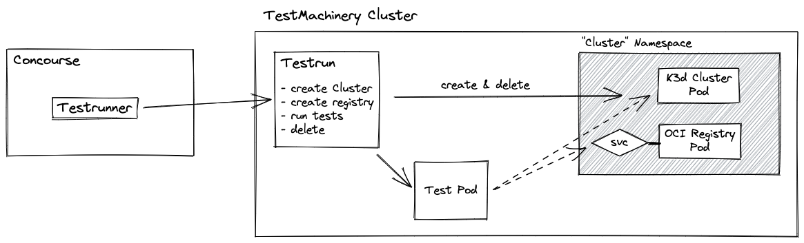

# Testing

This document describes how tests in the Landscaper project can be executed, how they can be written and how the execution in the pipelines work.

**Index:**
- [Testing](#testing)
		- [Unit Tests](#unit-tests)
			- [execute](#execute)
			- [write tests](#write-tests)
		- [Integration tests](#integration-tests)
			- [execution](#execution)
			- [write tests](#write-tests-1)

### Unit Tests

#### execute
Unit tests are completely written in golang and therefore can all be executed and debugged using the standard go tools.

The `make test` command should be used to run all unit tests as the integration tests are also written and go and would be executed if someone would just run `go test ./...`.

#### write tests

Unit tests are written in golang using the [ginkgo](https://onsi.github.io/ginkgo/) and [gomega](https://onsi.github.io/gomega/) testframework.

**Kubernetes Tests**<br>
Kubernetes specific tests can either be written using the [controller-runtime testframework](../../test/utils/envtest) or using the Landscaper integration tests.

Tests written with the controller-runtime framework can be executed locally without a running kubernetes. With the disadvantage that controller-runtime only offers a k8s api-server and an etcd. If other Kubernetes capabilities (especially the controllers or cloud capabilities) are needed, the test has to be written as Landscaper integration test.
But the controller-runtime framework based tests should be always favored over real integration tests due to their simplicity in execution and debugging.

Util functions can be found in [test/utils]() and new utils should be also added there.
The difference to the default landscaper utils package is that here also `ginkgo` or `gomega` functions can be used which are not allowed in the default utils package.

### Integration tests

Integration tests are tests that use a k8s-conformance-compliant cluster and optional a real oci-compliant registry.

#### execution

The tests are by default executed on every head-update of the main git branch and in case of a new release.
In both cases the [script](../../.ci/integration-test) is executed, which 

- creates a Gardener shoot cluster in the project *laas* on the Gardener Canary landscape
- installs the landscaper on the shoot cluster
- runs the tests
- deletes the shoot cluster if all tests succeeded, otherwise it lets the cluster as it is for further investigations

For a commit to a PR the [script](../../.ci/integration-test-new) is executed. It starts the integration tests 
if the comment of the commit contains a string *run-int-tests*, e.g. `git commit -m "some changes (run-int-tests)`. 
Otherwise, the tests are skipped. If you have pushed a commit with a message not containing *run-int-tests* you could just 
add a commit without changes but the right message to trigger the integration tests, e.g.:

```
git commit --allow-empty -m "some text (run-int-tests)"
git push
```

The integration test scripts clean up old test shoot clusters. More details about the cleanup strategy and further 
program details can be found in the corresponding script files.

All test shoot clusters names have the format it-pr<someNumber>-<4-digits> (e.g. it-pr12-4652), whereby
- <someNumber>==0 indicates that the script was triggered locally (see below)
- <someNumber>==1 indicates that the script was triggered by a commit to a head update or a new release
- otherwise, indicates that the script was triggered by a commit to a PR whereby <someNumber> contains the ID of the PR.

The integration tests can be optionally executed on a PR by commenting that PR with `/test`.
This will trigger the TestMachinery bot and will execute the integration tests for the PR in the TestMachinery.
Thereby the integration tests are executed on a [k3s cluster](https://k3s.io/) instead of a Gardener shoot cluster.

The TestMachinery itself works with 
- TestDefinitions that define a single test step (find them in [.test-defs](../../.test-defs))
- and Testruns that define the step execution order and configures the tests (find the one testrun in [.ci/testruns/integration-test](../../.ci/testruns/integration-test/templates/testrun.yaml))



**local execution**
The integration tests can also be executed locally by providing a kubernetes cluster. Then just run the tests with:

```
make integration-test KUBECONFIG_PATH=<path to cluster kubeconfig file> USE_OCM_LIB=false
```

The tests set up a local OCI registry, install/upgrade the landscaper and executes the integration tests.

It is also possible to execute the tests with Gardner shoot cluster creation and deletion with:

```
make integration-test-with-cluster-creation KUBECONFIG_PATH=<path to Gardener kubeconfig for project laas on the Canary landscape> USE_OCM_LIB=false
```

#### write tests

The integration tests are all combined in a single ginkgo test suite that can be found in [test/integration/suite_test.go](../../test/integration/suite_test.go).
That suite initializes the integration test framework (includes logging, other environment information) and then registers the different tests from different test files.

All tests are located in [test/integration/](../../test/integration/) where the tests can be described using the default ginkgo's `ginkgo.Describe|Context|IT` syntax.
Each `Describe` block should also first call the frameworks `Setup()` function to register logging and cleanup steps.
> Note: Ginkgo is also here used as executor so all ginkgo features like `Focus` or other should work as in other tests.

With that an integration test will look like the following snippet.
For a real example see [test/integration/tutorial/simple-import.go](../../test/integration/tutorial/simple-import.go) where also other helper functions like the `State` struct and others can be found.
```
func SimpleTest(f *framework.Framework) {
	_ = ginkgo.Describe("SimpleTest", func() {
		state := f.Register()
		
		ginkgo.It("some test", func(){
		 // test code ...
		})
	})
}
```
