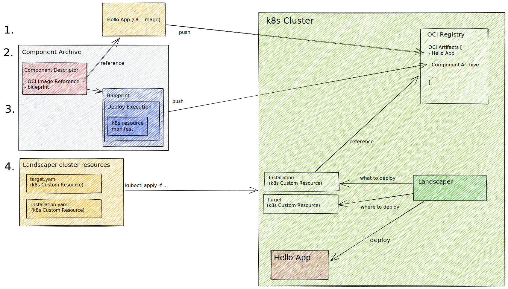
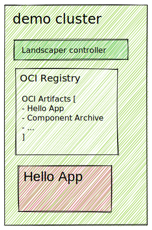
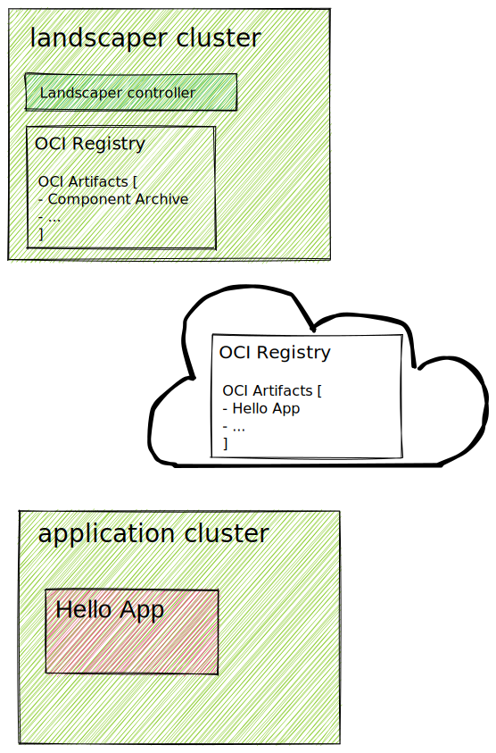

# Deploy applications via Landscaper using manifest deployer

## Introduction

This tutorial describes how to use the Landscaper manifest deployer for installing an application into a Kubernetes cluster.

The demo is ordered into the following activities:

- [Deploy applications via Landscaper using manifest deployer](#deploy-applications-via-landscaper-using-manifest-deployer)
  - [Introduction](#introduction)
  - [Preparation of dev environment](#preparation-of-dev-environment)
    - [Structure of demo material](#structure-of-demo-material)
    - [Install the Landscaper together with an OCI registry](#install-the-landscaper-together-with-an-oci-registry)
  - [Deploy applications via Landscaper](#deploy-applications-via-landscaper)
    - [1. Push demo image content into OCI registry](#1-push-demo-image-content-into-oci-registry)
    - [2. Develop Landscaper artifacts](#2-develop-landscaper-artifacts)
    - [3. Push Landscaper artifacts to OCI Registry](#3-push-landscaper-artifacts-to-oci-registry)
    - [4. Deploy the application](#4-deploy-the-application)



## Preparation of dev environment

Before you start, you need a working dev environment. If you do not have one, please refer to ["Prepare dev environment"](prepare-dev-environment.md).

First clone or download this Git repository. You will need the files in `docs/getting-started` later.

If you don't have access to a Gardener cluster, you can use a local Kubernetes environment like [Kind](https://kind.sigs.k8s.io). It is recommended to use the built-in [OCI registry](https://kind.sigs.k8s.io/docs/user/local-registry/) from kind in this case. Replace oci registry placeholders with `localhost:5001` in this case and set the environment variable `export OCI_REGISTRY=localhost:5001`. Use an explicit `--kubeconfig ...` in all calls.

### Structure of demo material

The folder demo content contains a sample OCI image.
The folder manifests contains all Kubernetes manifests.
The folder component-archive contains all resources needed for building Landscaper deployable component.

``` text
./manifest-deployer-tutorial/
├── component-archive
│   ├── blueprint
│   │   ├── blueprint.yaml
│   │   └── deploy-execution.yaml
│   ├── component-descriptor.yaml
│   └── resources.yaml
├── demo-content
│   └── hello.tar
├── manifests
│   ├── installation.yaml
│   ├── my-deployment.yaml
│   ├── my-secret.yaml
│   └── my-target.yaml
├── prepare-dev-environment.md
└── README.md
```

| Demo environment | Productive environment |
| ------------- |-------------|
| For demo purposes we will use a simplified setup with one cluster, which contains all necessary parts. | In a productive environment these could be separated. |
|  | |

### Install the Landscaper together with an OCI registry

For this tutorial we need the landscaper-controller running in the Kubernetes cluster as well as the
landscaper command line client (cli) to interact with the landscaper. In addition we need an OCI registry
to store the artifacts created in this tutorial.

The landscaper-cli provides a convenient quick start option for installing the Landscaper plus an OCI registry:

```bash
export OCI_USER=oci-user
export OCI_PASSWD='PSST!DONOTTELL!'

landscaper-cli quickstart install \
  --kubeconfig ~/.kube/config \
  --install-oci-registry \
  --install-registry-ingress \
  --registry-username $OCI_USER \
  --registry-password $OCI_PASSWD
```

This OCI registry is targeted only for development purposes and not for use in production.

If you have access to an OCI registry or use the OCI registry coming with kind omit the last three parameters and only install the landscaper:

```bash
landscaper-cli quickstart install \
  --kubeconfig ~/.kube/config \
  --install-oci-registry
```

A successful installation should look like this:

``` text
Landscaper installation succeeded!

The OCI registry can be accessed via the URL https://o.ingress.p.democlust.shoot.k8s.myprovider.com
It might take some minutes until the TLS certificate is created
```

Remember, you need this URL to access the OCI registry later on:

``` bash
export OCI_REGISTRY=o.ingress.p.democlust.shoot.k8s.myprovider.com
```

Check if all needed components of Landscaper is available:

``` bash
kubectl get pods -n landscaper --kubeconfig ~/.kube/config-demo.yaml
```

The installation should contain

- Landscaper
- Landscaper webhooks
- Container deployer
- Helm deployer
- Manifest deployer
- (OCI Registry) optional

```text
NAME                                                    READY   STATUS    RESTARTS   AGE
container-default-container-deployer-5c6as449f9-dz4x6   1/1     Running   0          25s
helm-default-helm-deployer-7cd3fd9797-5c5rk             1/1     Running   0          41s
landscaper-654cbc4568-x6bs7                             1/1     Running   0          53s
landscaper-webhooks-58995rff45-htwcf                    1/1     Running   0          53s
manifest-default-manifest-deployer-7fbc87ef79-xpfnq     1/1     Running   0          31s
oci-registry-6654f55648-wg7bq                           1/1     Running   0          60s

```

Check availability of OCI registry:

``` bash
curl --location --request GET https://$OCI_REGISTRY/v2/_catalog -u "$OCI_USER:$OCI_PASSWD"
```

The curl should return this:

```text
{"repositories":[]}
```

## Deploy applications via Landscaper

### 1. Push demo image content into OCI registry

For this tutorial an OCI image is provided. The image contains a dummy application just for demonstration purposes. It does nothing, just keeps the container running.

The image is located at /manifest-deployer-tutorial/demo-content/hello.tar.
For the next steps, Docker must be up and running in dev environment.

First, load the OCI image into local docker registry:

```bash
docker load --input ./demo-content/hello.tar
```

Then, push the OCI image into the OCI registry running inside the cluster.

``` bash
docker login -p $OCI_PASSWD -u $OCI_USER $OCI_REGISTRY

docker tag hello:v0.1.0 $OCI_REGISTRY/hello:v0.1.0

docker push $OCI_REGISTRY/hello:v0.1.0

curl --location --request GET https://$OCI_REGISTRY/v2/_catalog -u "$OCI_USER:$OCI_PASSWD"
```

### 2. Develop Landscaper artifacts

Landscaper artifacts are typically organized in a component archive as depicted below:

``` text
component-archive/
├── blueprint
│   ├── blueprint.yaml
│   └── deploy-execution.yaml
├── component-descriptor.yaml
└── resources.yaml
```

**[component-descriptor.yaml](https://github.com/gardener/landscaper/blob/master/docs/concepts/Glossary.md#component-descriptor)**: The component-descriptor.yaml is the BOM keeping track of all resources for a specific application with a specific version number. Under the definition of resources, things like container images, Landscaper blueprints, and helm charts are usually listed.

This is the pre-generated almost empty component descriptor. It already has a name and a version. You need to replace the placeholder `<OCIURL>` with the OCI registry URL obtained in the section "Install the Landscaper together with an OCI registry", e.g. "o.ingress.p.democlust.shoot.k8s.myprovider.com"

``` yaml
component:
  componentReferences: []
  name: test.net/test
  provider: internal
  repositoryContexts:
  - baseUrl: <OCIURL>
    componentNameMapping: urlPath
    type: ociRegistry
  resources: []
  sources: []
  version: v0.1.0
meta:
  schemaVersion: v2
```

**resources.yaml**: The resource.yaml contains a list of resource definitions for e.g. OCI images and Blueprints. The resources needed by our application are an OCI image containing the sample application and a blueprint describing the Landscaper deployment. Have a look at the resources and their yaml definition in /manifest-deployer-tutorial/resources.yaml. Later, it is shown how to update the component-descriptor.yaml with the resources specified in resources.yaml using the component-cli tool.

**[blueprint](https://github.com/gardener/landscaper/blob/master/docs/concepts/Glossary.md#blueprint)**: This folder contains the blueprint.yaml. The Blueprint specifies any import parameters necessary for a Landscaper deployment, it specifies what kind of deployment should be executed (deploy-execution.yaml), and it specifies if the deployment creates output via export parameters.

The application itself is not really of interest, it just keeps a container up and running. The container runs in a Pod, the  Pods has 3 Replicas, and all of this is specified in a Deployment manifest which you find in /manifest-deployer-tutorial/manifests/my-deployment.yaml. The other resource manifest we need for the application, is a Kubernetes resource of type Secret. This will allow Kubernetes to access the OCI registry which we deployed in the step "Install the Landscaper together with an OCI registry".

Let us go through the steps, to prepare our Landscaper manifest deployment:

1. In the component-descriptor.yaml (/manifest-deployer-tutorial/component-archive/), replace the `<OCIURL>` placeholder with the OCI registry URL as obtained in section "Install the Landscaper together with an OCI registry". E.g. replace `<OCIURL>` with o.ingress.p.democlust.shoot.k8s.myprovider.com.

2. In the resources.yaml (/manifest-deployer-tutorial/component-archive/), replace the `<IMAGEURL>` placeholder with the container image URL used in section "Push demo image content into OCI registry", to push the sample image into our OCI registry. E.g. replace `<IMAGEURL>` with o.ingress.p.democlust.shoot.k8s.myprovider.com/hello.

3. In deploy-excution.yaml (/manifest-deployer-tutorial/component-archive/blueprint/), replace the `<DOCKERCONFIG>` placeholder with a base64 encoded version of dockers config.json. You already did a docker login into your OCI registry, right?

    ``` bash
    cat ~/.docker/config.json | base64 --wrap=0
    # in MacOS
    cat ~/.docker/config.json | base64 --break 0
    ```

4. Add the resources defined in resource.yaml to component-descriptor.yaml by executing

    ``` bash
    component-cli component-archive resources add ./component-archive ./component-archive/resources.yaml
    ```

5. Verify updated content of component-descriptor. You need to replace the placeholder `<OCIURL>` with the OCI registry URL obtained in the section "Install the Landscaper together with an OCI registry", e.g. "o.ingress.p.democlust.shoot.k8s.myprovider.com"

    ``` yaml
    component:
      componentReferences: []
      name: test.net/test
      provider: internal
      repositoryContexts:
      - baseUrl: <OCIURL>
        componentNameMapping: urlPath
        type: ociRegistry
      resources:
      - access:
          imageReference: <OCIURL>/hello:v0.1.0
          type: ociRegistry
        name: hello
        relation: external
        type: ociImage
        version: v0.1.0
      - access:
          filename: sha256:a250692a6ca416d7d9442e22597eca9f2d5f0ab3dd2af231733ccdc3fb48820a
          mediaType: application/vnd.gardener.landscaper.blueprint.v1+tar+gzip
          type: localFilesystemBlob
        name: blueprint
        relation: local
        type: blueprint
        version: v0.1.0
      sources: []
      version: v0.1.0
    meta:
      schemaVersion: v2
    ```

6. Convert the component located in ./component-archive/ into the Component Transport Format (CTF/ just a compressed tar of the folder structure) and add it to a component archive (just a tar of one or more components in CTF) located here ./transport.tar:

    ``` bash
    component-cli ctf add ./transport.tar --component-archive ./component-archive/ --format tar
    ```

### 3. Push Landscaper artifacts to OCI Registry

Upload component-archive into our OCI registry:

``` bash
component-cli ctf push ./transport.tar
```

Verify content of OCI registry:

``` bash
curl --location --request GET https://$OCI_REGISTRY/v2/_catalog -u "$OCI_USER:$OCI_PASSWD"
```

The curl should return the following:

``` text
{"repositories":["component-descriptors/test.net/test","hello"]}
```

### 4. Deploy the application

Let's take a quick summary of what has been done so far. We installed the Landscaper plus an OCI registry into a Kubernetes cluster. We pushed the OCI image of our hello application into the OCI registry. We developed the component-descriptor which describes all resources needed for deploying the application, including the modified blueprint which describes what needs to be done to deploy the application. These artifacts were transformed into a component archive and uploaded as an OCI artifact into the OCI registry.

Now, we need to tell Landscaper to pick up the artifacts from the OCI registry and execute the deployment. To achieve this, we need to develop two Kubernetes custom resources.

1. The Target resource. This tells the Landscaper **where** it should deploy the application to. Landscaper currently supports only one target type, a kubernetes cluster.

    ``` yaml
    apiVersion: landscaper.gardener.cloud/v1alpha1
    kind: Target
    metadata:
      creationTimestamp: null
      name: my-cluster
      namespace: example
    spec:
      config:
        kubeconfig: |+
        <KUBECONFIG>

      type: landscaper.gardener.cloud/kubernetes-cluster
    ```

    Either replace the `<KUBECONFIG>` placeholder with your clusters kubeconfig, or use the landscaper-cli tool (recommended), to create the Target manifest:

    ```bash
    landscaper-cli targets create kubernetes-cluster --name my-cluster --namespace example --target-kubeconfig ~/.kube/config-demo.yaml > manifests/my-target.yaml
    ```

2. The Installation resource. While the Blueprint provided a specification of all import parameters, the Installation provides concrete values for the imports. Furthermore, the Installation makes a connection to the component-descriptor associated with the application we are going to deploy. The below Installation specifies the component-descriptor and the blueprint in that component descriptor it shall use (a component-descriptor can contain more than one blueprint). As for the imports, there is just one parameter which needs to be initialized. There is an import of type target with the name target. This is the same Target resource, we created in step 1. You find a sample Installation in /manifests/installation.yaml. Replace the `<OCIURL>` placeholder with the OCI registry URL you created in section "Install the Landscaper together with an OCI registry" such that it is specified where the referenced component descriptor is located.

    ``` yaml
    apiVersion: landscaper.gardener.cloud/v1alpha1
    kind: Installation
    metadata:
      name: manifest-demo
      namespace: example
    spec:
      blueprint:
        ref:
          resourceName: blueprint

      componentDescriptor:
        ref:
          componentName: test.net/test
          repositoryContext:
            baseUrl: <OCIURL>
            type: ociRegistry
          version: v0.1.0

      imports:
        targets:
          - name: cluster
            target: '#my-cluster'
    ```

3. Create **example** namespace

    ``` bash
    kubectl create namespace example --kubeconfig ~/.kube/config-demo.yaml
    ```

4. Apply the custom resources to your cluster:

    ``` bash
    kubectl apply -f manifests/my-target.yaml  --kubeconfig ~/.kube/config-demo.yaml
    kubectl apply -f manifests/installation.yaml --kubeconfig ~/.kube/config-demo.yaml
    ```

5. Verify the status of the deployment:

    ``` bash
    landscaper-cli installations inspect manifest-demo -n example
    ```

    The final status should look like this:

    ``` bash
    >$ landscaper-cli installations inspect manifest-demo -n example
    [✅ Succeeded] Installation manifest-demo
        └── [✅ Succeeded] DeployItem manifest-demo-default-deploy-item-ncflh
    ```

6. Check the deployments:

    After some time the deployment and pod(s) of your example should appear:

    ```bash
    kubectl get deployments --kubeconfig ~/.kube/config-demo.yaml -n example
    NAME               READY   UP-TO-DATE   AVAILABLE   AGE
    hello-deployment   1/1     1            1           12m


    kubectl get pods -n example --kubeconfig ~/.kube/config-demo.yaml
    NAME                                READY   STATUS    RESTARTS   AGE
    hello-deployment-6f8b8ff985-4gcr4   1/1     Running   0          8m
    ```

This is the end of this tutorial.
