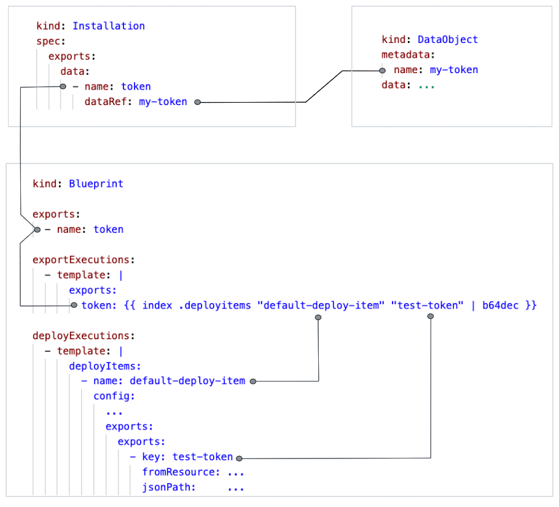

# Export Parameters

For prerequisites, see [here][1].

This example illustrates export parameters of blueprints.

The blueprint in this example uses the manifest deployer to create a `ServiceAccount` and an associated `Secret` 
of type `kubernetes.io/service-account-token`. Once the two objects are deployed on the target cluster, the 
control plane of the target cluster will automatically generate an API token and store it in the `Secret`
(see: [Manually create a long-lived API token for a ServiceAccount][2]).
The blueprint contains instructions for the manifest deployer to read that token.
The blueprint then provides the obtained token as an export parameter.
Finally, the `Installation` takes the value exported by the blueprint, and stores it in a `DataObject`.


## Declaring an Export of a Blueprint

The [blueprint](./blueprint/blueprint.yaml) of the present example declares one export parameter with name `token`: 

```yaml
exports:
- name: token
  type: data
  schema:
    type: string
```

In general, we distinguish export parameters of type `target` and `data`. To define data parameters more precisely, 
they have a `schema`, i.e. a json schema that describes the structure of the data.

For more details, see [Blueprints: Export Definitions][3].


## Where an Export Comes From

A Blueprint that declares an export parameter must define how to retrieve its value.
This can be done in two steps:
- by first [reading values from the target cluster](#reading-values-from-the-target-cluster),  
- and then applying an [export execution](#export-executions) to these values.  


### Reading Values from the Target Cluster

In the present example, the `DeployItem` deploys a `ServiceAccount` and a `Secret` on the target cluster. After the 
deployment of these objects, the following section of the `DeployItem` becomes relevant:

```yaml
exports:
  exports:
    - key: test-token
      fromResource:
        apiVersion: v1
        kind: Secret
        name: test-secret
        namespace: example
      jsonPath: .data.token
```

This section instructs the deployer to read the object from the target cluster which is specified in `fromResource`,
and then to extract from that object the value of the field specified in `jsonPath`.
In our case, we read the field `.data.token` from the `Secret` that we have deployed.
We want to refer to that value in the [export execution](#export-executions) below. 
Therefore, we give it a key as identifier: `key: test-token`. 

In this example, we read a field which does not exist right after the deployment. It is added afterwards by the 
control plane of the target cluster (see: [Manually create a long-lived API token for a ServiceAccount][2]).
Therefore, the deployer tries the read operation repeatedly, until it finds the value, or a [timeout][8] is exceeded.

Note that the mechanism described here is specific for the [helm deployer][6] and [manifest deployer][7].


### Export Executions

In the previous step, we have read values from the target cluster. These are not yet the export values of the
Blueprint. The actual export values of the Blueprint are constructed by a template specified in
section `exportExecutions` of the [Blueprint](./blueprint/blueprint.yaml). 
The template should produce a yaml of the following structure: 

```yaml
exports:
  <parameter name>: <parameter value>
  <parameter name>: <parameter value>
  ...
```

In our case, the template is:

```yaml
exports:
  token: {{ index .deployitems "default-deploy-item" "test-token" | b64dec }}
```

The data that can be filled into the template are the values that the `DeployItems` have read 
from the target cluster. Besides them, also other data like the imports of the Blueprint can be used in the template.
All these data are organized in a tree:  

```shell
.
├── deployitems
│   └── default-deploy-item  # name of the DeployItem
│       └── test-token       # key of the value provided by the DeployItem
├── imports
│   └── ...
...
```

Normally, you can access a field of the above tree by a path like 
`.deployitems.<name of deployitem>.<key>`. However, if the path contains "special" characters like a hyphen, you must 
use the `index` function instead: `index .deployitems "<name of deployitem>" "<key>"`.

For details, see [Blueprints: Rendering][4]


## Where an Export Goes To

An `Installation` must define what to do with the exports of its Blueprint. This is done in the section `exports` of 
the `Installation`. It connects each export parameters of the blueprint with a corresponding `DataObject` or `Target` 
where the value will be stored. 
These objects will be created in the same namespace as the `Installation`.

The `DataObjects` and `Targets` that one `Installation` exports can be imported by another `Installation`.

In our case, the export parameter `token` will be written to a `DataObject` with name `my-token`: 

```yaml
exports:
  data:
    - name: token        # name of the export parameter of the blueprint
      dataRef: my-token  # name of the DataObject
```

The general structure of the `exports` section of an `Installation` is this:

```yaml
exports:
  targets:
    - name:    <name of the export parameter of the blueprint>
      target:  <name of a Target in which the value will be stored>
  data:
    - name:    <name of the export parameter of the blueprint>
      dataRef: <name of a DataObject in which the value will be stored>
```

An important point with respect to the fields `target` and `dataRef` is that these should contain a valid name for
a k8s object. Otherwise, the Landsaper creates a hash for the name of the k8s object containing the export data. 

For more details, see [Installations: Exports][5].

The following diagram shows the linkages between Blueprint, Installation and DataObject, that we have discussed:




## Procedure

To deploy the example follow the steps below:

1. Insert the kubeconfig of your target cluster into your [target.yaml](installation/target.yaml).  

2. On the Landscaper resource cluster, create namespace `example` and apply
   the [context.yaml](./installation/context.yaml),
   the [target.yaml](installation/target.yaml), 
   and the [installation.yaml](installation/installation.yaml):

   ```shell
   kubectl create ns example
   kubectl apply -f <path to context.yaml>
   kubectl apply -f <path to target.yaml>
   kubectl apply -f <path to installation.yaml>
   ```

3. When the `Installation` has succeeded, there should be a `DataObject` on the Landscaper Resource Cluster 
   containing the value of the export parameter. Check its content:

   ```shell
   kubectl get dataobject -n example my-token -o yaml
   ```

   It should contain the same token that was automatically generated into the `Secret` on the target cluster:  

   ```shell
   kubectl get secret -n example my-secret -o json | jq .data.token -r | base64 -D
   ```

   Note that the token in the `Secret` is base64 encoded. Therefore, we must decode it first before we can compare it 
   with the token in the `DataObject`.


## References

[Prerequisites][1]  

[Manually create a long-lived API token for a ServiceAccount][2]

[Blueprints: Export Definitions][3]

[Blueprints: Rendering][4]

[Installations: Exports][5]  

[Helm Deployer][6]

[Manifest Deployer][7]

[1]: ../../README.md#prerequisites-and-basic-definitions  
[2]: https://kubernetes.io/docs/tasks/configure-pod-container/configure-service-account/#manually-create-a-long-lived-api-token-for-a-serviceaccount  
[3]: ../../../usage/Blueprints.md#export-definitions
[4]: ../../../usage/Blueprints.md#rendering
[5]: ../../../usage/Installations.md#exports
[6]: ../../../deployer/helm.md
[7]: ../../../deployer/manifest.md
[8]: ../../../usage/DeployItemTimeouts.md
