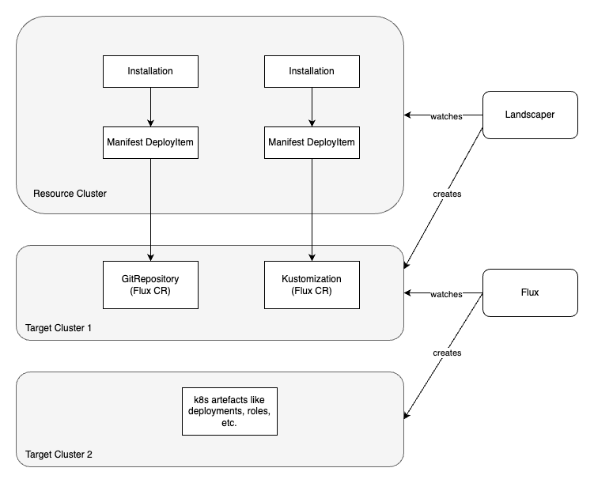

# Introduction to Kustomize Examples

The following examples show how to use the manifest deployer of the Landscaper to enable kustomize deployments using 
[Flux](https://fluxcd.io/flux/components/kustomize/).

The basic idea is depicted in the following diagram. You create Flux custom resources (GitRepository, Kustomization)
with Landscaper Installations containing manifest DeployItems in some Target Cluster 1. A Flux installation watching this
cluster reacts on these custom resources and creates the final kubernetes resources in some Target Cluster 2, 
based on the referenced kustomize files.



Using this approach, to utilize Flux to enable kustomize deployment with the Landscaper, allows to export and import
data between different kustomize deployments and even between Helm and kustomize deployments.

The following examples show different approaches how to combine Landscaper and Flux to enable kustomize deployments.

# Install Flux

The rest of this Chapter describes how to install Flux itself with the help of the Landscaper. Of course, you can also 
use one of the different approaches described [here](https://fluxcd.io/flux/installation/) to get some running 
Flux system.

## Procedure

The procedure to install the flux controllers is as follows:

1. Adapt the [settings](https://github.com/gardener/landscaper/tree/master/docs/guided-tour/kustomize/01-kustomize-introduction/commands/settings) file
   such that the entry `TARGET_CLUSTER_KUBECONFIG_PATH` points to the kubeconfig of the target cluster.

2. On the Landscaper resource cluster, create a namespace `cu-example`.

3. Run the script [deploy-k8s-resources script](https://github.com/gardener/landscaper/tree/master/docs/guided-tour/kustomize/01-kustomize-introduction/commands/deploy-k8s-resources.sh).
   It will create  Landscaper custom resources on the resource cluster in namespace `cu-example`, namely a Target, a Context, and an Installation.


## Inspect the Result

On the resource cluster you can check the status of the Installation:

```shell
❯ landscaper-cli inst inspect -n cu-example

[✅ Succeeded] Installation flux
    └── [✅ Succeeded] Execution flux
        └── [✅ Succeeded] DeployItem flux-item-82ccc
```

As a result, on the target cluster, the flux controllers should run in namespace `flux-system`: 

```shell
❯ kubectl get deployments -n flux-system

NAME                   READY   UP-TO-DATE   AVAILABLE   AGE
kustomize-controller   1/1     1            1           12m
source-controller      1/1     1            1           12m
```

We have only installed the kustomize controller and the source controller of Flux. This is defined by the Helm values
in the [deploy item](blueprint/deploy-execution.yaml).


## Cleanup

You can remove the Installation with the script
[commands/delete-installation.sh](https://github.com/gardener/landscaper/tree/master/docs/guided-tour/kustomize/01-kustomize-introduction/commands/delete-installation.sh).

When the Installation is gone, you can delete the Context and Target with the script
[commands/delete-other-k8s-resources.sh](https://github.com/gardener/landscaper/tree/master/docs/guided-tour/kustomize/01-kustomize-introduction/commands/delete-other-k8s-resources.sh).
