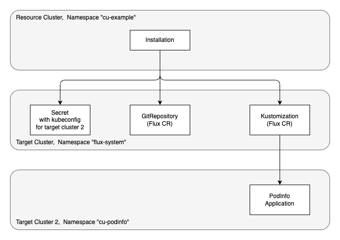

# Deploying the PodInfo Application with Landscaper and Flux

This example deploys [Stefan Prodan's podinfo application][1].
The deployment proceeds in two stages. First, Landscaper creates Flux custom resources, namely a [GitRepository][2] and a
[Kustomization][3] resource. Based on these resources, Flux installs then the podinfo application.


## Prerequisites

For the usual prerequisites, see [here](../../README.md).
In addition, we use a second target cluster (which may coincide with the first). 
The first target cluster is for the Flux resources, and the second for the podinfo application. 

Moreover, we assume that Flux is installed on the first target cluster.
We need the [source controller][4] and the [kustomize controller][5] of Flux.
Example [Install Flux](../01-kustomize-introduction/README.md#install-flux) shows how to install them with the Landscaper.


## Scenario

The diagram below provides an overview of the clusters and resources in this example.



The first row of the diagram shows the Landscaper resource cluster, where we will create an Installation.
The Installation uses the manifest deployer to deploy the following resources on the first target cluster, 
shown in the second row.

- a Secret that contains the kubeconfig of the second target cluster. This Secret is referenced by the Kustomization 
  below, so that Flux can access the second target cluster and deploy the podinfo application there.

- a GitRepository custom resource by Flux. It points to a commit of the git repository https://github.com/stefanprodan/podinfo.
  The git repository URL and commit are specified in the [component version](commands/component-constructor.yaml):

    ```yaml
    - name: podinfo-gitrepo
      type: blob
      version: 6.7.0
      access:
        type: gitHub
        repoUrl: https://github.com/stefanprodan/podinfo
        commit: 0b1481aa8ed0a6c34af84f779824a74200d5c1d6  # required
        ref: 6.7.0
    ```

  The [template for the deploy item](blueprint/deploy-execution.yaml) takes them from there:

    ```yaml
    apiVersion: source.toolkit.fluxcd.io/v1
    kind: GitRepository
    metadata:
      name: podinfo
      namespace: flux-system
    spec:
      {{- $res := getResource .cd "name" "podinfo-gitrepo" }}
      url: {{ $res.access.repoUrl }}
      ref:
        tag: {{ $res.access.ref }}
      interval: 60m
      timeout: 60s
    ```

- a Kustomization custom resource by Flux. It points to the directory `./kustomize` in the above
  Git repository. The deployment is done using kustomize according to the `kustomization.yaml` in this directory.

    ```yaml
    apiVersion: kustomize.toolkit.fluxcd.io/v1
    kind: Kustomization
    metadata:
      name: podinfo
      namespace: flux-system
    spec:
      force: false
      interval: 30m
      kubeConfig:
        secretRef:
          key: kubeconfig
          name: cluster2
      path: ./kustomize
      prune: true
      retryInterval: 2m0s
      sourceRef:
        kind: GitRepository
        name: podinfo
      targetNamespace: cu-podinfo
      timeout: 3m0s
      wait: true
    ```

The creation of the `GitRepository` and `Kustomization` resources starts a gitops process, which reconciles the resources of 
the podinfo application periodically (specified in field `spec.interval`), and also when the sources are changed. 
As a consequence, the status of the `GitRepository` and `Kustomization` resources can change over time. This 
process is controlled by Flux, and not monitored by the Landscaper.
The task of the Landscaper in this scenario is only to create the `GitRepository` and `Kustomization` resources. 
Once this is done, the Installation will be in a final phase (`Succeeded` or `Failed`). It will remain in this phase
until a new reconcile of the Installation is triggered.


## Procedure

1. Adapt the [settings](commands/settings) file
   such that
    - entry `TARGET_CLUSTER_KUBECONFIG_PATH` points to the kubeconfig of the first target cluster,
    - entry `TARGET_CLUSTER_KUBECONFIG_PATH_2` points to the kubeconfig of the second target cluster.

2. Create the following namespaces:
    - namespace `cu-example` on the resource cluster,
    - namespace `flux-system` on the first target cluster,
    - namespace `cu-podinfo` on the second target cluster.

3. Run the script [deploy-k8s-resources script](commands/deploy-k8s-resources.sh).
   It will create the Installation on the resource cluster (shown in the first row of the diagram),
   as well as its Target and Context.

   
## Inspect the Result

On the resource cluster you can inspect the Installation:

```shell
❯ landscaper-cli inst inspect -n cu-example podinfo

[✅ Succeeded] Installation podinfo
    └── [✅ Succeeded] Execution podinfo
        ├── [✅ Succeeded] DeployItem podinfo-item-1-9lvzt
        └── [✅ Succeeded] DeployItem podinfo-item-2-6tz9v
```

On the first target cluster:

```shell
❯ kubectl get secrets -n flux-system
NAME       TYPE     DATA   AGE
cluster2   Opaque   1      43m

❯ kubectl get gitrepositories -n flux-system
NAME         URL                                       AGE   READY   STATUS
podinfo      https://github.com/stefanprodan/podinfo   43m   True    stored artifact for revision '6.7.0@sha1:0b1481aa8ed0a6c34af84f779824a74200d5c1d6'

❯ kubectl get kustomizations -n flux-system
NAME                     AGE   READY
podinfo                  43m   True
```

On the second target cluster, the podinfo application should run in namespace `cu-podinfo`:

```shell
❯ kubectl get deployments -n cu-podinfo

NAME                      READY   UP-TO-DATE   AVAILABLE   AGE
deployment.apps/podinfo   2/2     2            2           43m
```


## Cleanup

You can remove the Installation with the script
[commands/delete-installation.sh](commands/delete-installation.sh).

When the Installation is gone, you can delete the Context and Target with the script
[commands/delete-other-k8s-resources.sh](commands/delete-other-k8s-resources.sh).


<!-- References -->

[1]: https://github.com/stefanprodan/podinfo
[2]: https://fluxcd.io/flux/components/source/gitrepositories/
[3]: https://fluxcd.io/flux/components/kustomize/kustomizations/
[4]: https://fluxcd.io/flux/components/source/
[5]: https://fluxcd.io/flux/components/kustomize/