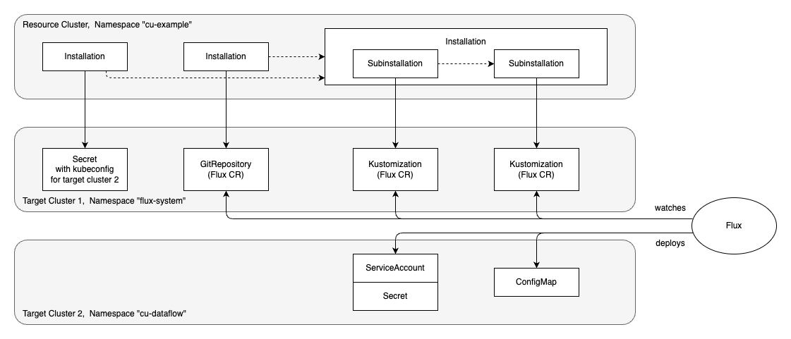

# Dataflow Example

In this example, Landscaper creates again Flux custom resources on a first target cluster, and based on them, 
Flux installs resources on a second target cluster. Landscaper controls the deployment as in the 
[previous example](../03-podinfo-landscaper-controlled/README.md).

This example is more complex as there are two subinstallations with a dataflow between them.
The new feature here is that resources from the second target cluster are taken into account for 
a custom readiness check and for the collection of export parameters.

## Prerequisites

For the usual prerequisites, see [here](../../README.md).
In addition, we use a second target cluster (which may coincide with the first).

Moreover, we assume that Flux is installed on the first target cluster.
We need the [source controller][1] and the [kustomize controller][2] of Flux.
Example [Install Flux](../01-kustomize-introduction/README.md#install-flux) shows how to install them with the Landscaper.


## Overview

The diagram below provides an overview of the clusters and resources in this example. 
The first row of the diagram shows the Landscaper resource cluster, where we will create Installations.
These Installations deploy Flux custom resources and a Secret on the first target cluster, shown in the second row of the diagram.
The Flux custom resources in turn are watched by Flux controllers, which then deploy the actual application on a second target cluster, shown in the last row.
In our case the application simply consists of a ServiceAccount, a Secret, and a ConfigMap.



The dashed horizontal arrows in the diagram indicate the dataflow between the Installations.

- The first Installation `dataflow-secret` creates a Secret that contains the kubeconfig of the second target cluster.
  It exports the name of the Secret.
- The second Installation `dataflow-gitrepository` creates a Flux custom resource of kind GitRepository.
  It exports the name of the GitRepository resource.
- The third Installation has two subinstallations. The first subinstallation `dataflow-tokenprovider` exports a token, 
  which it reads from a Secret on the second target cluster. The second subinstallation `dataflow-tokenconsumer` imports
  the token and writes it into a ConfigMap on the second target cluster. 

As we already know, every deploy item has a Target. It is normally used to deploy resources, perform readiness checks, and collect exports. 
The new feature here is that for readiness checks and the collection of exports, a second Target can be specified.
In our case, a custom readiness check waits until a token has been generated into a Secret on target cluster 2, and then
exports this token.
The sections [Custom Readiness Check with Another Target](#custom-readiness-check-with-another-target) and 
[Export Collection with Another Target](#export-collection-with-another-target) below explain how to specify such a second target.


## Procedure

1. Adapt the [settings](https://github.com/gardener/landscaper/tree/master/docs/guided-tour/kustomize/03-dataflow/commands/settings) file
   such that 
   - entry `TARGET_CLUSTER_KUBECONFIG_PATH` points to the kubeconfig of the target cluster,
   - entry `TARGET_CLUSTER_KUBECONFIG_PATH_2` points to the kubeconfig of the second target cluster.

2. Create the following namespaces:
   - namespace `cu-example` on the resource cluster,
   - namespace `flux-system` on the target cluster,
   - namespace `cu-dataflow` on the second target cluster.

3. Run the script [deploy-k8s-resources script](https://github.com/gardener/landscaper/tree/master/docs/guided-tour/kustomize/03-dataflow/commands/deploy-k8s-resources.sh).
   It will create the Installations on the resource cluster (shown in the first row of the diagram), 
   as well as their Target and a Context.


## Inspect the Result

On the resource cluster you can inspect the Installations:

```shell
❯ landscaper-cli inst inspect -n cu-example

[✅ Succeeded] Installation dataflow-secret
    └── [✅ Succeeded] Execution dataflow-secret
        └── [✅ Succeeded] DeployItem dataflow-secret-item-shn92

[✅ Succeeded] Installation dataflow-gitrepository
    └── [✅ Succeeded] Execution dataflow-gitrepository
        └── [✅ Succeeded] DeployItem dataflow-gitrepository-item-62j66

[✅ Succeeded] Installation dataflow-root
    ├── [✅ Succeeded] Installation dataflow-tokenconsumer-778g7
    │   └── [✅ Succeeded] Execution dataflow-tokenconsumer-778g7
    │       └── [✅ Succeeded] DeployItem dataflow-tokenconsumer-778g7-item-tlzcf
    └── [✅ Succeeded] Installation dataflow-tokenprovider-tw4h5
        └── [✅ Succeeded] Execution dataflow-tokenprovider-tw4h5
            └── [✅ Succeeded] DeployItem dataflow-tokenprovider-tw4h5-item-mm6bt
```

On the first target cluster, you should find the resources created by the Installations:

- a Secret `cluster2` containing the kubeconfig of the second target cluster. This Secret is referenced by the Kustomizations
  below, so that Flux can access the second target cluster.
- a [GitRepository](https://fluxcd.io/flux/components/source/gitrepositories/) custom resource. It points to the 
  Git repository containing the manifests that Flux will deploy on the second target cluster. As it happens, it is the 
  Landscaper Git repository.
- two [Kustomizations](https://fluxcd.io/flux/components/kustomize/kustomizations/) custom resources. They define
  which resources from the Git repository will be deployed on the second target cluster.
  These are the resources in the directories [resources/first](https://github.com/gardener/landscaper/tree/master/docs/guided-tour/kustomize/03-dataflow/resources/first) 
  and [resources/second](https://github.com/gardener/landscaper/tree/master/docs/guided-tour/kustomize/03-dataflow/resources/second). 
  Both directories contain a `kustomization.yaml` file. 

```shell
❯ kubectl get secrets -n flux-system
NAME       TYPE     DATA   AGE
cluster2   Opaque   1      117m

❯ kubectl get gitrepositories -n flux-system
NAME         URL                                      AGE    READY
landscaper   https://github.com/gardener/landscaper   103m   True

❯ kubectl get kustomizations -n flux-system
NAME                     AGE    READY
dataflow-tokenconsumer   103m   True
dataflow-tokenprovider   103m   True
```

On the second target cluster, there should be the ServiceAccount, Secret, and ConfigMap, that were created by 
the Flux Kustomizations.

```shell
❯ kubectl get serviceaccount -n cu-dataflow
NAME                   SECRETS   AGE
test-service-account   0         108m

❯ kubectl get secrets -n cu-dataflow
NAME          TYPE                                  DATA   AGE
test-secret   kubernetes.io/service-account-token   3      109m

❯ kubectl get configmaps -n cu-dataflow
NAME               DATA   AGE
test-configmap     1      109m
```


## The Dataflow

Installation 3 in the diagram has two subinstallations
[dataflow-tokenprovider](blueprints/root/subinst-tokenprovider.yaml) and 
[dataflow-tokenconsumer](blueprints/root/subinst-tokenconsumer.yaml). 
There is a dataflow between them. 
Subinstallation `dataflow-tokenprovider` creates indirectly via Kustomization a Secret on the second target cluster. 
The Secret has type `kubernetes.io/service-account-token`, so that a token will be generated into it.
The subinstallation (more precisely, its DeployItem) has a custom readiness check, so that it waits until this token 
has been generated. When the token is available, the subinstallation exports it. 
Subinstallation `dataflow-tokenconsumer` imports the token and writes it into the ConfigMap that it indirectly creates.

Normally, readiness checks and exports take into account resources of the target cluster. 
In our scenario, the target cluster is the one with the Flux custom resources.
However, our custom readiness check should consider the Secret on the second target cluster. 
To achieve this, subinstallation `dataflow-tokenprovider` has two target import parameters. We use target import 
parameter `custer` for the deployment of the Flux custom resources, and target import parameter `cluster2` for the 
custom readiness check and the collection of exports. 

```yaml
imports:
  - name: cluster
    type: target
    targetType: landscaper.gardener.cloud/kubernetes-cluster
  - name: cluster2
    type: target
    targetType: landscaper.gardener.cloud/kubernetes-cluster
```

### Custom Readiness Check with Another Target

Custom readiness checks defined in a deploy item have an optional field `targetName`. 
If omitted, the target of the deploy item is used as default.
In our scenario, we set this field to the name of the second imported target 
(see [deploy execution of subinstallation "tokenprovider"](./blueprints/tokenprovider/deploy-execution.yaml)):

```yaml
readinessChecks:
  disableDefault: true
  custom:
    - name: TokenGenerated
      targetName: {{ .imports.cluster2.metadata.name }}
      resourceSelector:
        - apiVersion: v1
          kind: Secret
          name: test-secret
          namespace: cu-dataflow
      requirements:
        - jsonPath: .data.token
          operator: exists
```

As a consequence, the resource whose readiness is checked, is read from the second target cluster.

Note that field `targetName` is only supported for custom readiness checks, not for default readiness checks.

### Export Collection with Another Target

The exports of a deploy item have an optional field `targetName`. 
If omitted, the target of the deploy item is used as default.
In our scenario, we set this field to the name of the second imported target
(see [deploy execution of subinstallation "tokenprovider"](./blueprints/tokenprovider/deploy-execution.yaml)):

```yaml
exports:
  exports:
    - key: test-token
      targetName: {{ .imports.cluster2.metadata.name }}
      fromResource:
        apiVersion: v1
        kind: Secret
        name: test-secret
        namespace: cu-dataflow
      jsonPath: .data.token
```

As a consequence, the export value is read from a resource on the second target cluster.


## Cleanup

You can remove the Installation with the script
[commands/delete-installation.sh](https://github.com/gardener/landscaper/tree/master/docs/guided-tour/kustomize/03-dataflow/commands/delete-installation.sh).

When the Installation is gone, you can delete the Context and Target with the script
[commands/delete-other-k8s-resources.sh](https://github.com/gardener/landscaper/tree/master/docs/guided-tour/kustomize/03-dataflow/commands/delete-other-k8s-resources.sh).


<!-- References -->

[1]: https://fluxcd.io/flux/components/source/
[2]: https://fluxcd.io/flux/components/kustomize/