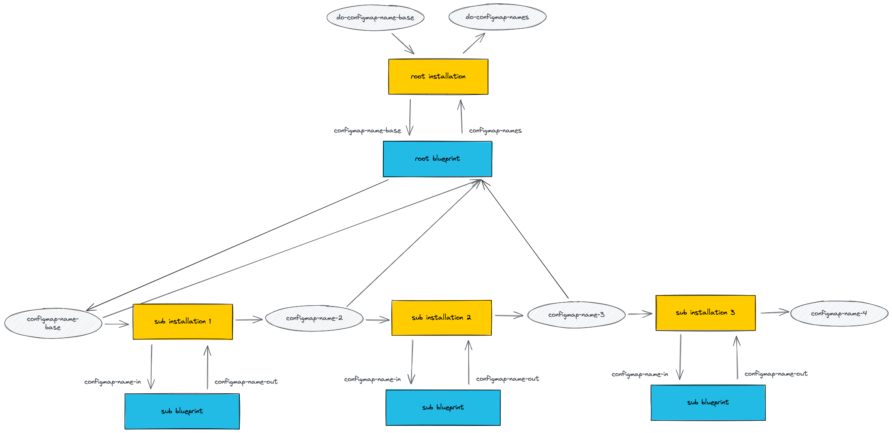

# Export-Import

The blueprint in this example has three subinstallations.
All three subinstallations use the same blueprint, which creates a configmap.

Each subinstallation imports the name of the configmap that it creates (import parameter `configmap-name-in`)
and exports a slightly modified name (export parameter `configmap-name-out`) which serves as import for the next
subinstallation.

The root installation exports the list of all configmap names.

The following diagram shows the data flow. (The parameter for the target is omitted.)




## Procedure

1. On the target cluster, create a namespace `example`. It is the namespace into which we will deploy the ConfigMaps.

2. On the Landscaper resource cluster, create a namespace `cu-example`.

3. On the Landscaper resource cluster, in namespace `cu-example`, create a Target `my-cluster` containing a
   kubeconfig for the target cluster, a Context `landscaper-examples`, a DataObject `do-configmap-name-base`, 
   and an Installation `export-import`. There are templates for these resources in the directory
   [installation](https://github.com/gardener/landscaper/tree/master/docs/guided-tour/subinstallations/export-import/installation).
   To apply them:
    - adapt the [settings](https://github.com/gardener/landscaper/tree/master/docs/guided-tour/subinstallations/export-import/commands/settings) file
      such that the entry `RESOURCE_CLUSTER_KUBECONFIG_PATH` points to the kubeconfig of the resource cluster,
      and the entry `TARGET_CLUSTER_KUBECONFIG_PATH` points to the kubeconfig of the target cluster,
    - run the [deploy-k8s-resources script](https://github.com/gardener/landscaper/tree/master/docs/guided-tour/subinstallations/export-import/commands/deploy-k8s-resources.sh),
      which will template and apply the Target, Context, DataObject, and Installation.


As a result, the three subinstallations have deployed three ConfigMaps on the target cluster in namespace `example`:

```shell
$ kubectl get configmaps -n example

NAME                    DATA   AGE
example-configmap       1      41s
example-configmap-x     1      36s
example-configmap-x-x   1      31s
```

The export parameter of the root installation is written to the DataObject `do-configmap-names` in namespace `cu-example`
on the resource cluster. The export execution of the root blueprint defines the value of this export parameter, namely 
the list of the three ConfigMap names.

```shell
$ kubectl get dataobject -n cu-example do-configmap-names -o yaml

apiVersion: landscaper.gardener.cloud/v1alpha1
kind: DataObject
metadata:
  name: do-configmap-names
  namespace: cu-example
  ...
data:
- example-configmap
- example-configmap-x
- example-configmap-x-x
```


## Cleanup

You can remove the Installation with the
[delete-installation script](https://github.com/gardener/landscaper/tree/master/docs/guided-tour/subinstallations/export-import/commands/delete-installation.sh).
When the Installation is gone, you can delete the Context and Target with the
[delete-other-k8s-resources script](https://github.com/gardener/landscaper/tree/master/docs/guided-tour/subinstallations/export-import/commands/delete-other-k8s-resources.sh).


