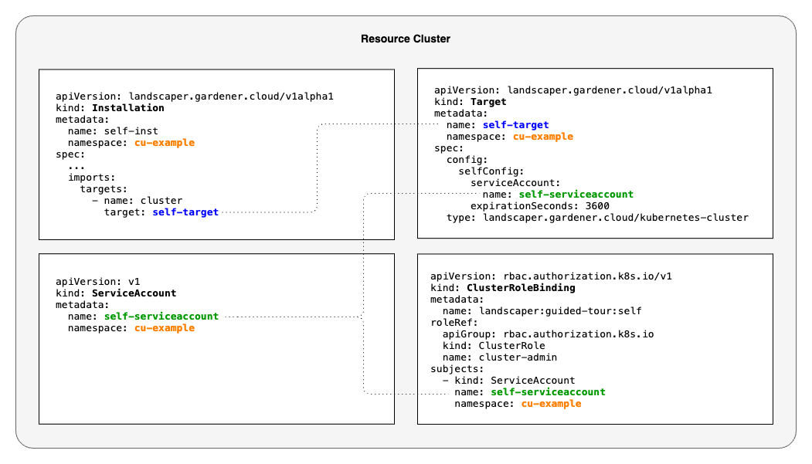

# Self Targets

This example demonstrates how you can use the Landscaper to deploy objects on its own resource cluster.
This means in this example the resource cluster and the target cluster are the same.
For this use-case, the Landscaper provides a special type of targets, so-called 
[Self Targets](../../../usage/Targets.md#targets-to-the-landscaper-resource-cluster-self-targets).
Their advantage is that you do not need to include a kubeconfig into them. Instead, the Target references a ServiceAccount
in the same Namespace. The Self Target in this example looks as follows:

```yaml
apiVersion: landscaper.gardener.cloud/v1alpha1
kind: Target
metadata:
  name: self-target
  namespace: cu-example
spec:
  type: landscaper.gardener.cloud/kubernetes-cluster
  config:
    selfConfig:
      serviceAccount:
        name: self-serviceaccount
      expirationSeconds: 3600
```

This Target references a [ServiceAccount `self-serviceaccount`](installation/serviceaccount.yaml.tpl).
A [ClusterRoleBinding `landscaper:guided-tour:self`](installation/clusterrolebinding.yaml.tpl) binds the ServiceAccount 
to the ClusterRole `cluster-admin`, so that it has the necessary rights to create objects on the resource cluster.
The [Installation `self-inst`](installation/installation.yaml.tpl) uses the Target to deploy a ConfigMap on the 
resource cluster.


## Procedure

1. In the [settings](commands/settings) file, adjust the variables `RESOURCE_CLUSTER_KUBECONFIG_PATH`.

2. On the Landscaper resource cluster, create namespaces `cu-example` and `example`.

3. Run script [commands/deploy-k8s-resources.sh](commands/deploy-k8s-resources.sh).
   It templates the following objects and applies them to the resource cluster:
   - [ServiceAccount `self-serviceaccount`](installation/serviceaccount.yaml.tpl),
   - [ClusterRoleBinding `landscaper:guided-tour:self`](installation/clusterrolebinding.yaml.tpl),
   - [Target `self-target`](installation/target.yaml.tpl),
   - [Installation `self-inst`](installation/installation.yaml.tpl).  
   
   The diagram below provides an overview of these objects.

4. Wait until the Installation is in phase `Succeeded` and check that it has created a ConfigMap `self-target-example`
   in namespace `example` on the resource cluster.




## Cleanup

You can remove the Installation with the
[delete-installation script](commands/delete-installation.sh).
When the Installation is gone, you can delete the Target, ClusterRoleBinding, and ServiceAccount with the
[delete-other-k8s-resources script](commands/delete-other-k8s-resources.sh).


## References

[Self Targets](../../../usage/Targets.md#targets-to-the-landscaper-resource-cluster-self-targets)
