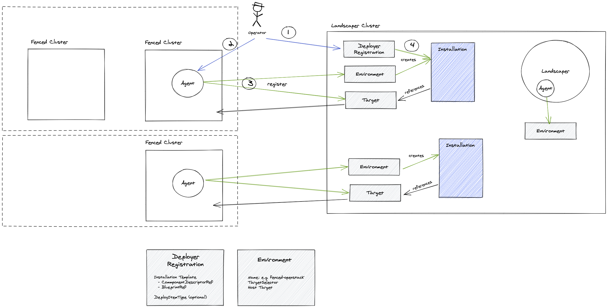

# Deployer Lifecycle Management

## Motivation

Coming from deployers that are integrated into the landscaper it is pretty easy to get started using the landscaper as the only one helm chart has to be installed and managed.

When Landscaper is deployed in production or a fenced landscape has to be reached that approach is not suitable anymore. 
Then all deployers that are needed in the landscape and the fenced landscape would have to be managed on their own with their own lifecycle (create a target, create and update installations for every instance that is needed).
Although, 90% of all deployers are currently deployed the same way with the same imports and configuration.
In addition, it contradicts with our extensibility concept as specific deployers would be shipped the landscaper but would need their own lifecycle.

In order to support fenced environment and automated deployer management a component is needed that installs and upgrades deployers.
Analogous to the kubelet and gardenlet, we would introduce a `Landscapelet` or a `Landscaper Agent` that does exactly that.

That agent would automatically register itself with a target (poiting to its own cluster) and a `Environment` resource that contains environment specific data (e.g. the target selector) for the deployers.

In addition, Deployers are not directly installed using installation (which is of course still possible) but by defining an installation template (called Deployer Registrations). 
That template in conjunction with the environment is then used to generate an installation for the target.
Therefore, registering new environment would simply require the agent to be installed and new deployer installation would be automatically created.

> Note: To not require additional effort when installing the deployers in the same cluster as the landscaper. The agent is also automatically included in the landscaper deployment. With that no additional complexity for the operator would be added. 

In order to execute the installation and install the deployers on the target cluster, the agent is shipped with a simple helm deployer and then all other deployers are recursively deployed.
> Recusive means in that context that e.g. if a deployer A needs deployer B to be installed. Deployer B only requires the already available helm deployer in the agent.
> Then both installations (and their respective deployitems) are created. 
> Deployer B would be immediately installed and as soon as it is ready Deployer B would install Deployer A.
> 
> Note that in this scenario dead-locks are possible as a dependency cycle could occur.

