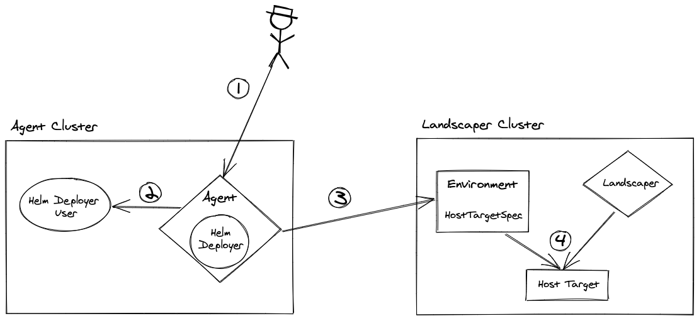
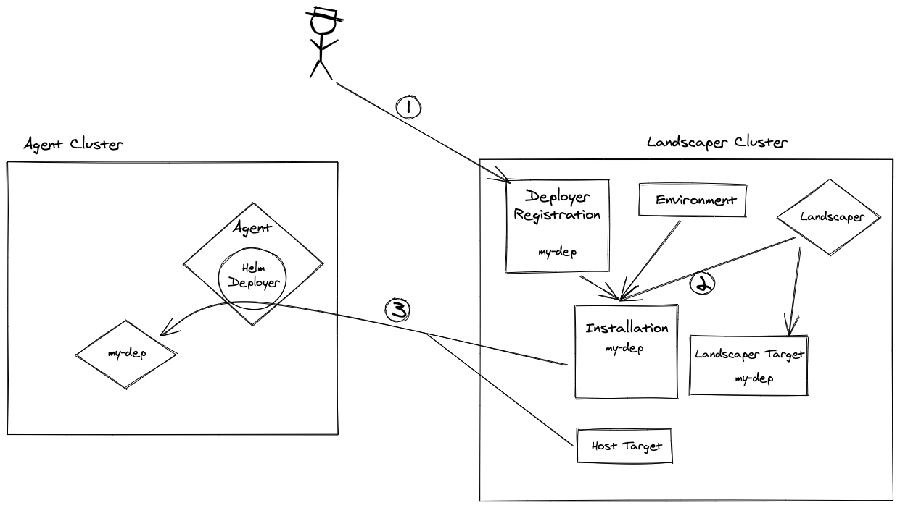

# Deployer Lifecycle Management

**Index**:
- [Motivation](#motivation)
- [Install the agent](#install-the-agent)
- [Architecture](#architecture)

## Motivation

Coming from deployers that are integrated into the landscaper it is pretty easy to get started using the landscaper as only one helm chart has to be installed and managed.

When Landscaper is deployed in production or a fenced landscape has to be reached that approach is not suitable anymore. 
Then all deployers that are needed in the landscape, and the fenced landscape would have to be managed on their own with their own lifecycle (create a target, create and update installations for every instance that is needed).
Although, 90% of all deployers are currently deployed the same way with the same imports and configuration.
In addition, it contradicts with our extensibility concept as specific deployers would be shipped the landscaper but would need their own lifecycle.

In order to support fenced environments and automated deployer management a component is needed that installs and upgrades deployers.
Analogous to the kubelet and gardenlet, we would introduce a `Landscapelet` or a `Landscaper Agent` that does exactly that.
> Note: The purpose of Gardenlets are to manage shoot cluster and are build for scalability.
> Whereas the Landscaper agent's purpose is to simplify the deployer lifecycle and reach fenced environments.
> To avoid confusion the we call that component `Landscaper Agent`.

That agent would automatically register itself with a target (pointing to its own cluster) and a `Environment` resource that contains environment specific data (e.g. the target selector) for the deployers.

In addition, Deployers are not directly installed using installations (which is of course still possible), but by defining an installation template (called Deployer Registrations). 
That template in conjunction with the environment is then used to generate an installation for the target.
Therefore, registering new environment would simply require the agent to be installed and new deployer installation would be automatically created.

> Note: To not require additional effort when installing the deployers in the same cluster as the landscaper, the agent is included in the landscaper deployment. With that no additional complexity for the operator would be added. 

In order to execute the installation and install the deployers on the target cluster, the agent is shipped with a simple helm deployer. 
All other deployers are then deployed in an order specified by their required deployers - the deployer(s) which only need a helm deployer are installed first, then the ones which depend on them, and so on.
> e.g. if a deployer A needs deployer B to be installed. Deployer B only requires the already available helm deployer in the agent.
> Then both installations (and their respective deployitems) are created. 
> Deployer B would be immediately installed and as soon as it is ready Deployer B would install Deployer A.
> 
> Note that in this scenario dead-locks are possible as a dependency cycle could occur.


## Install the agent

The agent is a simple kubernetes controller that includes a helm deployer that can only reconcile one specific target.
It is provided as [helm chart](../../charts/landscaper-agent) that can be installed using helm 3 like:
```
helm upgrade --install my-env ./charts/landscaper-agent -f values.yaml
```

The agent can be configured using a values.yaml file.
To see all configuration options see the [here](../../charts/landscaper-agent/values.yaml)
```yaml

agent:
  # Provide the kubeconfig to the landscaper cluster.
  # Can be provided as secret or directly paste the kubeconfig.
  # required
  landscaperClusterKubeconfig:
     secretRef: my-kubeconfig-secret
     kubeconfig: |
       <landscaper-cluster-kubeconfig>
  
  # Set the name of the environment. 
  # Defaults to the name of the helm chart (helm install <name>).
  name: ""
  # Namespace where the deployers should be installed.
  # Defaults to the same namespace as the agent.
  namespace: ""

```

## Architecture

Assumption: Landscaper is already running in a cluster



1. The agent is installed into another cluster and connects to the Landscaper cluster
1. The agent creates a service account, a cluster role and a clusterrolebinding. That service is used to create a secret `default-target-access` containing the kubeconfig for the host cluster.
1. The agent creates an environment object with the given configuration and information from the local cluster.<br>
  The environment is created with an agent finalizer. That finalizer is never removed by the agent itself. So it has to be removed manually when an agent is deinstalled.
    ```yaml
    apiVersion: landscaper.gardener.cloud/v1alpha1
    kind: Environment
    metadata:
      finalizers:
      - finalizer.agent.landscaper.gardener.cloud
      name: default
    spec:
      hostTarget:
        annotations:
          landscaper.gardener.cloud/environment: default
        config:
          kubeconfig:
            secretRef:
              key: kubeconfig
              name: default-target-access
              namespace: ls-system
        type: landscaper.gardener.cloud/kubernetes-cluster
      landscaperClusterConfig:
        apiPath: ""
        caData: "" # the ca data of the Landscaper cluster
        host: https://10.43.0.1:443
        insecure: false
      namespace: ls-system
      targetSelectors:
      - targets:
        - name: default
          namespace: ""
      - annotations:
        - key: landscaper.gardener.cloud/environment
          operator: =
          values:
          - default
      - annotations:
        - key: landscaper.gardener.cloud/environment
          operator: '!'
    ```
1. The Landscaper reacts on the new environment, adds its own finalizer `finalizer.deployermanagement.landscaper.gardener.cloud` and creates a target as specified in the environment (`spec.hostTarget`).<br>
   Note: The secretRef points to a secret that is only accessible in the agents host cluster. So the access to the agent cluster is never stored in the landscaper cluster.
      ```yaml
      apiVersion: landscaper.gardener.cloud/v1alpha1
      kind: Target
      metadata:
        annotations:
          landscaper.gardener.cloud/environment: default
        name: default
        namespace: ls-system
        ownerReferences:
        - apiVersion: landscaper.gardener.cloud/v1alpha1
          blockOwnerDeletion: true
          controller: true
          kind: Environment
          name: default
      spec:
        config:
          type: landscaper.gardener.cloud/kubernetes-cluster
          kubeconfig:
            secretRef:
              key: kubeconfig
              name: default-target-access
              namespace: ls-system
      ```



1. Now Deployers can be registered by creating a `DeployerRegistration`.
    ```yaml
    apiVersion: landscaper.gardener.cloud/v1alpha1
    kind: DeployerRegistration
    metadata:
      name: mock
    spec:
      types:
      - landscaper.gardener.cloud/mock
      installationTemplate:
        blueprint:
          ref:
            resourceName: mock-deployer-blueprint
        componentDescriptor:
          ref:
            componentName: github.com/gardener/landscaper/mock-deployer
            repositoryContext:
              baseUrl: eu.gcr.io/gardener-project/development
              type: ociRegistry
            version: vx.y.z
        importDataMappings: {}
          # targetSelectors: [] # optional 
          # values: {} # optional
        imports: {}
    ```

1. The Landscaper reacts on the new DeployerRegistration and creates
   - a service account `<deployer registration name>-<environment-name>`
   - a cluster role and cluster role binding (with permissions deployers need on the Landscaper cluster: Access to secrets and access to DeployItems).
   - a Target `<deployer registration name>-<environment-name>` with the created service account (the target points to the landscaper cluster)
   - an Installation using the DeployerRegistration and Environment.
    ```yaml
    apiVersion: landscaper.gardener.cloud/v1alpha1
    kind: Installation
    metadata:
      finalizers:
      - finalizer.deployermanagement.landscaper.gardener.cloud
      - finalizer.landscaper.gardener.cloud
      labels:
        deployers.landscaper.gardener.cloud/deployer-registration: mock
        deployers.landscaper.gardener.cloud/environment: default
      name: mock-default
      namespace: ls-system
    spec:
      blueprint:
        ref:
          resourceName: mock-deployer-blueprint
      componentDescriptor:
        ref:
          componentName: github.com/gardener/landscaper/mock-deployer
          repositoryContext:
            baseUrl: eu.gcr.io/gardener-project/development
            type: ociRegistry
          version: vx.y.z
      importDataMappings:
        identity: mock-default
        releaseName: mock-default
        releaseNamespace: ls-system
        targetSelectors:
        - targets:
          - name: default
            namespace: ""
        - annotations:
          - key: landscaper.gardener.cloud/environment
            operator: =
            values:
            - default
        - annotations:
          - key: landscaper.gardener.cloud/environment
            operator: '!'
        values: {}
      imports:
        targets:
        - name: cluster
          target: '#default'
        - name: landscaperCluster
          target: '#mock-default'
    ```
1. With that the default Landscaper installation flow starts and the execution and deployitems are created.
1. The DeployItems are defined to use the Target created in step 4.
   With this the helm deployer that is included in the agent will start to reconcile deploy items of type `helm`.
1. Deployer that are deployed using Helm are now successfully installed and connected.
   These deployer can also now start to reconcile their DeployItems with Target annotated as `landscaper.gardener.cloud/environment: <env name>`.
