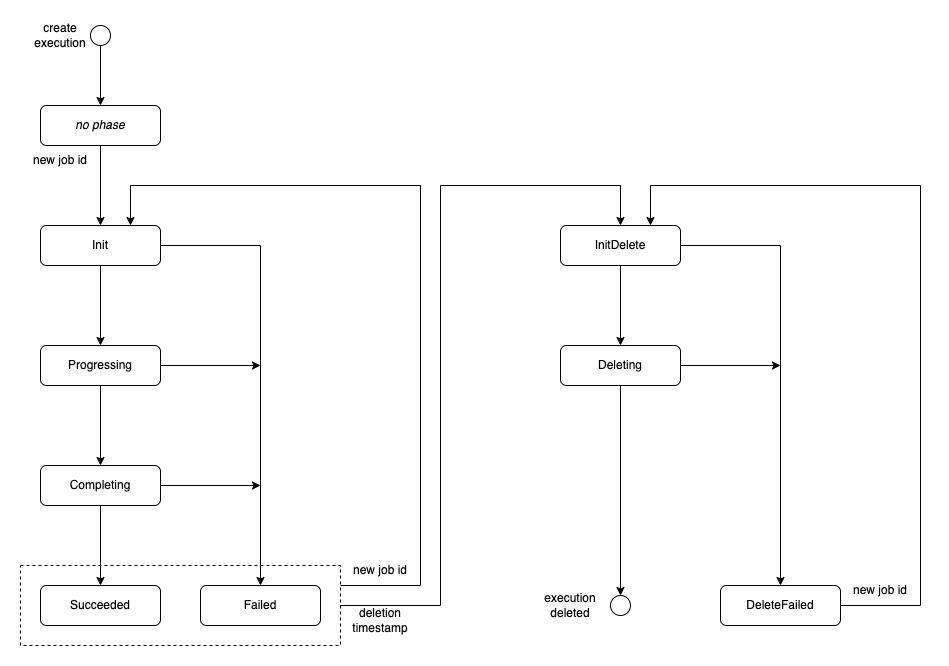

# Execution Controller

An execution is part of an object tree with a root installation at its top. It is created (resp. updated, deleted) 
by the controller of its parent installation in this object tree. It contains in its spec the templated 
deploy items. The task of the execution controller is to create (resp. update, delete) the deploy items accordingly,
and to collect their status and export data.

## Execution Phases

Every reconciliation of an execution is part of a [reconcile job](installation_controller.md#reconcile-jobs) that starts
at the root installation and propagates through the object tree.

The reconciliation of an execution is divided into phases. The diagram below shows the phases and transitions. 
The phases on the left hand side constitute the **installation flow** of an execution: 
`Init`, `Progressing`, `Completing`, `Succeeded`, resp. `Failed` in case of an error.
The phases on the right hand side constitute the **deletion flow**: `InitDelete`, `Deleting`, and in case of an 
error `DeleteFailed`.

#### Creation of an Execution

An execution is created by the installation controller in 
[phase "Init" of its parent installation](installation_controller.md#phase-init).
Immediately after the creation, an execution does not yet have a status and thus neither a job ID nor a phase.
The reconcile does not start directly, rather it waits for a job ID. 
In [phase "ObjectsCreated" of the parent installation](installation_controller.md#phase-objectscreated) 
the installation controller copies the job ID of the parent installation into the status field `jobID` of the execution.
When the job ID is set, the reconcile flow of the execution starts with phase `Init`.  

#### Phase "Init"

The controller reads all deploy item resources that are managed by the execution. It compares them with the deploy item 
definitions in the spec of the execution.
Deploy item resources which have no counterpart in the execution spec are **orphaned**. They will be cleaned up by the
controller. In all other cases the deploy item resource will be created or updated according to the definition in the 
execution spec.

#### Phase "Progressing" 

The deploy items that were created or updated during the `Init` phase will not be processed by a deployer before the
current job ID has been passed to them. As with installations and executions, the job ID serves as a trigger for 
processing a deploy item. 

Since there might be dependencies between deploy items, we do not trigger them all at once. A deploy item is triggered 
only when all its predecessors are finished. In more detail, this is done as follows. We divide the deploy items in the 
following classes:

- First, the class of all deploy items that have already been triggered, i.e. have already received the current job ID. 
  We check their status, and divide them in the following sub-classes:

  - (A) finished and phase = `Succeeded`
  - (B) finished and phase = `Failed`
  - (C) not finished

- Second, the class of all deploy items that have not yet been triggered.
  These deploy items need to be updated by the execution controller. We devide them in the following sub-classes:

  - (D) no pending predecessors
  - (E) pending predecessors

Based on this classification, the reconcile logic is as follows:

- If all deploy items are in class A (triggered, finished and succeeded), the controller continues with the next phase
  `Completing`.

- If there exists a deploy item in class B (triggered, finished and failed), the controller stops triggering any
  further deploy items, but remains in phase `Progressing` until the currently running deploy items have 
  finished, i.e. until there are no more items of class C. Then it changes the phase to `Failed`.

- Otherwise, all deploy items in class D (not yet triggered and no pending predecessors) are triggered.

Remark: there is a check to detect if the algorithm is stuck. This would be the case if there are neither unfinished 
items (class C) nor triggerable items (class D), but still items with pending predecessors (class E). 
In this case the execution phase is set to `Failed`.
Cyclic dependencies between the deploy items would lead to this situation.

#### Phase "Completing"

The controller collects the export data and sets the phase `Succeeded`.

#### Errors

The error handling is similar to that of the installation controller, i.e. we distinguish normal and fatal errors. 
Normal errors lead to a retry of the current phase. Fatal errors change the phase to `Failed` (resp. `DeleteFailed`), 
so that the current flow is finished.

#### Starting Another Reconcile Flow

A new reconcile job can only be started at the root installation, and only when the root installation
(and thus the complete object tree) is finished.
During such a job, the execution spec can be updated by the controller of its parent installation. 
Such a spec update alone does not trigger a reconcile of the execution.
The execution controller waits until the execution has received the new job ID. Then the execution phase is changed to
`Init` and the new reconcile flow of the execution starts.

Note that a new job ID triggers a new reconcile regardless whether or not the execution spec was modified.

#### Deleting an Execution

The deletion of an execution is always part of a job that has started with the deletion of the root installation and 
propagates through the object tree. During the job, the execution gets a deletion timestamp in
[phase "InitDelete" of the parent installation](installation_controller.md#phase-initdelete). 
When it also has received the job ID in 
[phase "TriggerDelete" of the parent installation](installation_controller.md#phase-triggerdelete)), 
the deletion flow of the execution starts with phase `InitDelete`.

#### Phase "InitDelete"

In phase `InitDelete`, the controller deletes all deploy items that are controlled by the execution.

#### Phase "Deleting"

The deploy items that were deleted in the `InitDelete` phase get a deletion timestamp, but will not vanish immediately
due to their finalizers. They must be processed by a deployer, which can perform uninstall operations and remove the 
finalizer. As always, the processing by a deployer starts only if a trigger in form of the job ID is set.
Since there might be dependencies between deploy items, we do not trigger them all at once. The procedure is analogous 
to phase `Progressing`, but this time a deploy item is triggered only after all its successors are gone. 
To do this, we divide the deploy items in the following classes:

- First, the class of all deploy items that have already been triggered, i.e. have already received the current job ID.
  We check their status, and divide them in the following sub-classes. Note that there is no phase `DeleteSucceeded`, 
  because such deploy items are gone.

  - (B) finished and phase = `DeleteFailed`
  - (C) not finished

- Second, the class of all deploy items that have not yet been triggered.
  These deploy items need to be updated by the execution controller. According to the state of their successors, we 
  devide them in the following sub-classes:

  - (D) deploy items whose successors are all finished 
  - (E) deploy items with unfinished successors

Based on this classification, the reconcile logic is as follows:

- If all deploy items are gone, the controller removes the finalizer of the execution, so that the execution will 
  vanish.

- If there exists a deploy item in class B (triggered, finished and failed), the controller stops triggering any
  further deploy items, but remains in phase `Deleting` until the currently running deploy items have
  finished, i.e. until there are no more items of class C. Then it changes the phase to `DeleteFailed`.

- Otherwise, all deploy items in class D (all successors finished) are triggered.

Remark: there is a similar check as in phase `Progressing` to detect if the algorithm is stuck.
