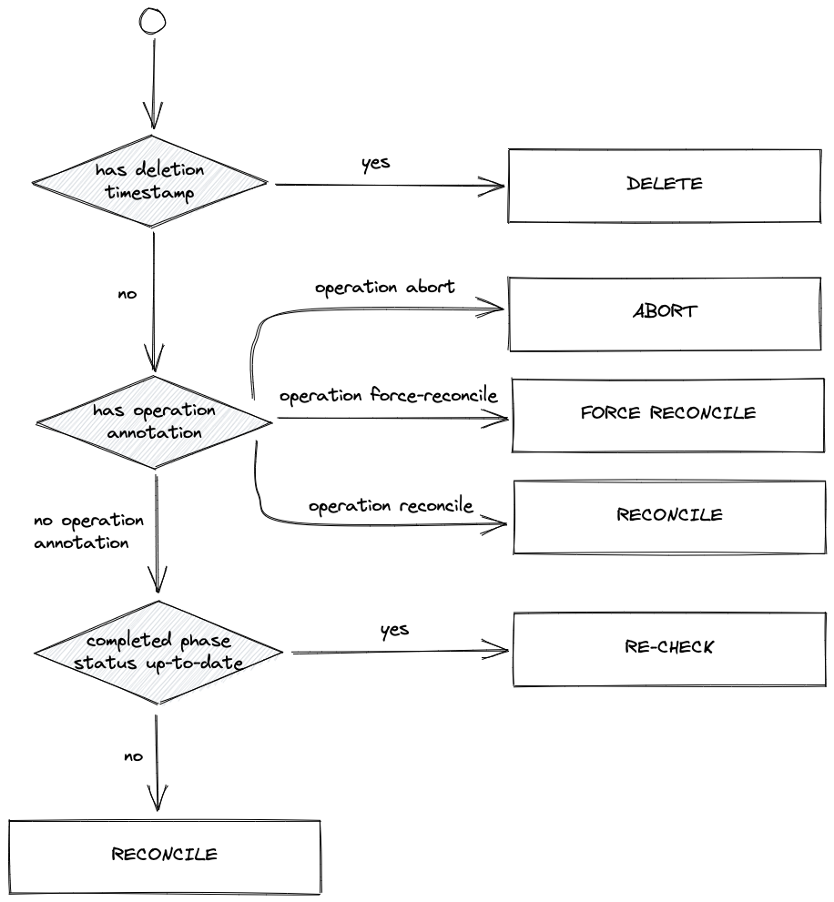
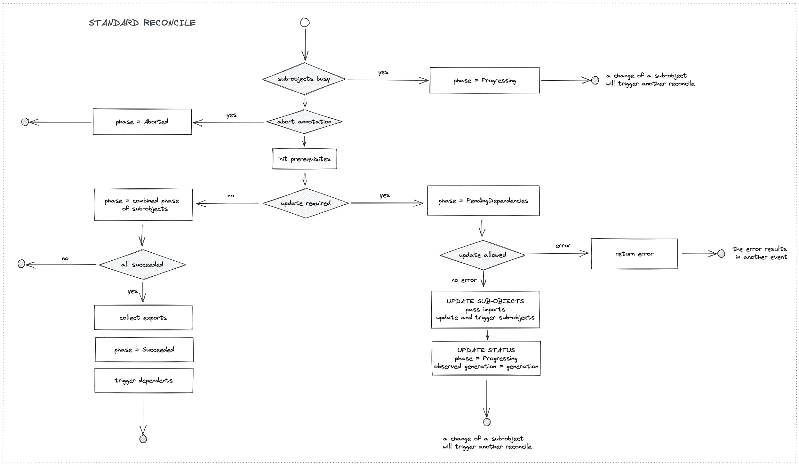
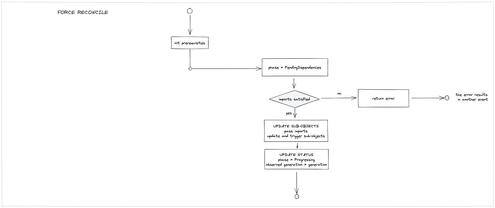
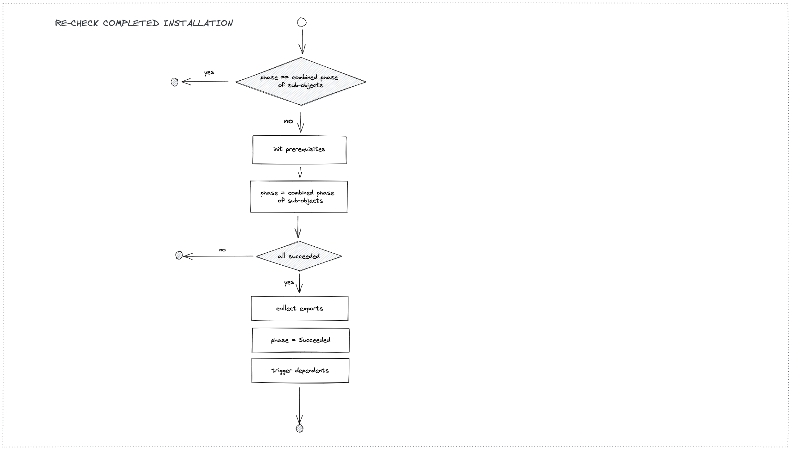

# Installation Controller

The reconciliation flow of the installation controller is described in detail [here](./reconciliation_flow.md).
It executes one of the following main operations:

- a deletion,
- a [standard reconcile](#standard-reconcile),
- a [force reconcile](#force-reconcile),
- or a [re-check of completed installation](#re-check-completed-installation).

The diagrams below illustrate these flows. First, the decision which main operation will be executed: 

##### Phases

The status of an installation contains a phase. The possible values are divided into two classes:
- **completed phases**: `Succeeded`, `Failed`, `Aborted`,
- **not completed phases**: `Init`, `PendingDependencies`, `Progressing`, `Deleting`.

The status of an execution also has a phase. But executions use only a subset of the values, see 
[Execution Controller Phases](./execution_controller.md#phases).

The **combined phase** of a list of objects (installations or executions) is defined as:
- `Progressing`: if one of the objects has phase `PendingDependencies`, `Progressing`, or `Deleting`;
- `Aborted`:     otherwise, if one of the objects has phase `Aborted`;
- `Failed`:      otherwise, if one of the objects has phase `Failed`;
- `Init`:        otherwise, if one of the objects has phase `Init`;
- `Succeeded`:   otherwise - i.e. if all objects are `Succeeded`.

Roughly speaking, this is the way how the installation phase is computed from the phases of its sub-installations and
execution, provided the sub-objects do not need an update.

## Standard Reconcile

##### Sub-Objects Busy

The condition "sub-objects busy" in the above diagram means that at least one of the sub-objects (execution, 
sub-installations) is "busy" in the following sense: an object is "busy" if its phase is not completed, 
or if its status is not up-to-date (`generation != observedGeneration`).

As long as an installation has a "busy" sub-object, the installation controller does not interrupt the work of all the
sub-objects with updates of their spec.

##### Update Required

An update is required in the following cases:

- if the status of the installation is not up-to-date (`generation != observedGeneration`) 
- or if one of the imports has been modified, see [Standard Reconciliation](./reconciliation_flow.md#standard-reconciliation),
- or if the installation is failed and has the reconcile annotation. 

## Force Reconcile

## Re-Check Completed Installation

