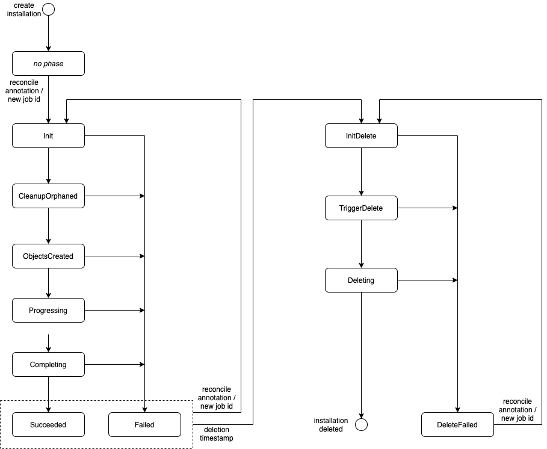

# Installation Controller

## Reconcile Jobs

The reconciliation of landscaper objects (installations, executions, deploy items) always starts at a root installation.
Each objects that is being reconciled triggers a reconcile of its subobjects, i.e. installations trigger their 
subinstallations and executions, and executions trigger their deploy items. In this way a reconcile that was 
started at a root installation propagates through the complete object tree. This walk through the object tree of a
root installation is called a **job**. A job has a job ID, a UUID, that is generated when the root installation starts 
its reconcile. At first, it is stored in the status field `jobID` of the root installation. All other objects also have 
this field, and during the job every object passes the job ID to its subobjects. Receiving the job ID serves as
trigger for an object to start its reconcile. 
The details are explained in the next section [Installation Phases](#installation-phases).

When an object has finished its reconcile, it copies the job ID into its status field `jobIDFinished`. 
The equality of these two status fields is the indicator that an object has finished its reconcile.
At various occasions during a reconcile, there are checks whether subobjects or predecessors are in a finished state;
all these checks are based on the comparison of job IDs and finished job IDs.
Each object must wait until all its subobjects have finished their reconcile, before the object itself can change into 
a finished state. In particular, the root installation will be the last one that finishes. A new reconcile job of the
root installation (and therefore of the complete object tree) can only start if the previous job has finished.


## Installation Phases

The reconciliation of an installation is divided into several phases. The diagram below shows these phases and the
possible transitions between them. The phases on the left hand side constitute the **installation flow**:
`Init`, `ObjectsCreated`, `Progressing`, `Completing`, `Succeeded`, resp. `Failed` in case of an error.
The phases on the right hand side constitute the **deletion flow**: `InitDelete`, `TriggerDelete`, `Deleting`, and in
case of an error `DeleteFailed`.




#### Creation of an Installation

Immediately after its creation, an installation does not yet have a status and thus neither a job ID nor a phase. 
The reconcile does not start directly, rather it requires a trigger. 

To trigger the reconcile of a **root installation** the user must add a reconcile annotation. (The annotation 
could already be included in the installation manifest during creation.) The controller will then generate a job ID and 
store it in the installation status. It will also remove the reconcile annotation, so that the user could add it again 
to request another reconcile job. (Note that such a follow-up reconcile job does not start before the current job has 
finished.) When this has been done, the reconcile starts with phase `Init`.

The reconcile of a **non-root installation** is triggered when the parent installation passes the job ID to the 
subinstallation. The parent does this in its phase `ObjectsCreated`. When this has happened, the reconcile starts with 
phase `Init`.

Note that only root installations can be triggered via reconcile annotation. A reconcile annotation at a non-root
installation has no effect and will be removed.

#### Phase "Init"

During the `Init` phase, the installation controller 
- reads the blueprint of the installation, 
- reads the parent and sibling installations,
- checks that all predecessors are finished and succeeded,
- reads the imports, checks that they exist, and writes them into the own context,
- computes a hash of the imports and stores it in the status. This allows to detect later whether the imports have 
  been changed during the reconcile flow, 
  see [phase "Completing - Collecting Exports](#phase-completing---collecting-exports).
- templates and creates all subobjects (subinstallations and execution).

#### Phase "ObjectsCreated"

In this phase the controller triggers the installation flow for all subobjects of the current installation.
This is done by passing the job ID of the current installation to all subobjects, i.e. to the subinstallations and 
execution.

#### Phase "Progressing"

In this phase the controller checks whether all subobjects are finished (`Succeeded` or `Failed`).
As long as there are unfinished subobjects, the phase remains `Progressing`, and the check is repeated in increasing
intervals. When all subobjects are finished the controller proceeds with the next phase `Completing`.

#### Phase "Completing" - Collecting Exports

The first task in phase `Completing` is the collection of export values.

This task starts with a check whether the spec or the imports of the current installation have been changed during the
current flow. Such a change might result in inconsistencies, because an export execution can access not only the exports
of subobjects, but also the imports. Therefore, the phase becomes `Failed` if spec or imports have changed.
A change of the spec can be detected by comparing generation and observed generation. A change of the imports can be
detected by comparing their hashes. (During the `Init` phase, a hash of all imports was stored in the status.)
If an installation has failed, because its spec or imports were changed, a reconcile annotation can be added to the
root installation to start a new reconcile job. The new reconcile job will take the changed spec and imports into 
account.

A structure is created that contains the exports of all subobjects, as well as the imports.
Based on these data, the export execution of the blueprint and afterwards the export data mapping of the installation 
are executed. Finally, the resulting exports are stored in targets, data objects, etc.

#### Phase "Completing" - Triggering Successors

The second task of the `Completing` phase is the triggering of successors. Successors are the sibling installations
which import an export parameter of the current installation. Root installations are triggered with a reconcile
annotation. Non-root installations are triggered by raising a reconcile event for them. The triggered successors will
check in their own `Init` phase whether all preconditions for them are satisfied, because they might have other
predecessors besides the current installation.

When the successors have been successfully triggered, the reconcile of this installation is finished. 
The controller sets the phase equal to `Succeeded` and the finished job ID equal to the job ID.

#### Errors

Suppose an error occurs during the installation flow (resp. deletion flow.)
We distinguish between **normal errors** that could be resolved by a retry, and **fatal errors** for which a retry does 
not make sense. 

In case of a normal error, the controller will repeat the current phase. Earlier, already accomplished 
phases are not repeated. If a phase needs to be retried several times, the intervals in between are growing. 

In case of a fatal error, the phase changes to `Failed` (resp. `DeleteFailed`), so that the current flow is finished.
The finished job ID is set equal to the job ID.

#### Starting Another Reconcile Job

Updating the spec or imports of a root installation does not yet start a new reconcile job. A reconcile annotation is 
necessary to trigger the reconcile. This is only possible at root installations; a reconcile annotation at a non-root 
installation has no effect.

Suppose a reconcile annotation is added at a root installation while there is already a reconcile job running. 
Then the current job is not interrupted. The handling of the reconcile annotation is postponed until the current job has 
finished. Note that a changed spec or changed imports have an impact on the collection of exports in 
[phase "Completing"](#phase-completing---collecting-exports).

#### Deleting an Installation

If the user deletes a root installation, the deletion flow will be started. However, a currently running installation 
flow will be finished first. 

The first delete does not require a trigger in form of a reconcile annotation; the deletion flow starts automatically.
On the other hand, suppose a previous deletion flow has failed, and the installation is now in phase `DeleteFailed`. 
Then the deletion flow can be restarted via a reconcile annotation. In both cases the controller generates a new 
job ID and the deletion flow starts with phase `InitDelete`.

#### Phase "InitDelete"

Phase `InitDelete` starts with a check whether there still exist successors of the current installation, i.e. siblings 
that import an export of the current installation. Successors must be deleted first. Therefore, the installation
remains in phase `InitDelete` as long as successors exist. The phase and thus also the check are repeated in
increasing time intervals.

If there are no successors, all subobjects are deleted. From then on, all subobjects have a deletion timestamp, but 
their finalizers prevent the actual removal.

#### Phase "TriggerDelete"

In phase `TriggerDelete` the job ID of the installation is passed to all subobjects. This triggers the 
deletion flow of the subobjects.

#### Phase "Deleting"

In phase `Deleting` the controller checks the subobjects. As long as there exist unfinished subobjects, the current
installation remains in phase `Deleting`. When all subobjects are finished, there are two possible cases. First, all 
subobjects are gone; then the finalizer of the own installation is removed so that it will also disappear.
Second, there still exist subobjects and they are all in phase `DeleteFailed`. Then the current installation changes 
also to phase `DeleteFailed` and the finished job ID is set equal to the job ID.

Remark: Suppose the installation has unfinished, as well as failed subobjects. One might think that already a single 
failed subobject would justify phase `DeleteFailed`. Nevertheless, the installation remains in phase `Deleting`.
The reason is that a switch to `DeleteFailed` would contradict the principle that an object must not finish before all 
its subobjects have finished.


## Additional Operations

### Interrupting a Job

A running job can be interrupted by adding the following annotation to an installation or execution:

```yaml
metadata:
  annotations:
    landscaper.gardener.cloud/operation=interrupt
```

The interrupt annotation is propagated through the tree of subobjects of the annotated object:

- **Installation controller:** When the installation controller processes an installation with interrupt annotation, it removes the annotation from
  the installation and adds it to all subobjects.
- **Execution controller:** When the execution controller processes an execution with interrupt annotation, it removes 
  the annotation from the 
  execution. It also modifies the status of the deploy items that are not yet finished with the current job. The phase
  is set equal to `Failed` and the finished job ID equal to the job ID. 
  The `lastError` status field of the deploy items is filled with a message so that it is clear that an interruption
  has caused the failure. 
  Since the deploy items are then finished, the executions and installations of the interrupted tree can be processed 
  as usual, and will also finish.
- **Deployer:** The interrupt annotation on a deploy item has no effect. It is the execution controller which interrupts
  deploy items.

After an interruption, a new job can be started by adding a reconcile annotation at the root installation.

### Delete Without Uninstall

It is possible to delete a root installation and the complete tree of subobjects, without deleting the installed 
artifacts from the target clusters. 
This can be achieved by adding the following annotation at the root installation **before** deleting it:

```yaml
metadata:
  annotations:
    landscaper.gardener.cloud/delete-without-uninstall=true
```

The controllers handle the delete-without-uninstall annotation in the following way:

- **Installation controller:** Suppose the installation controller processes an installation with the
  delete-without-uninstall annotation and a deletion timestamp. In the `InitDelete` phase, the controller passes the
  annotation to the subobjects of the installation (subinstallations and execution). Then it deletes the subobjects.  
- **Execution controller:** Suppose the execution controller processes an execution with the
  delete-without-uninstall annotation and a deletion timestamp. In the `InitDelete` phase, the controller passes the
  annotation to the deploy items managed by the execution. Then it deletes the deploy items.
- **Deployer:** Deployers should follow the rules defined in the [deployer contract](./deployer_contract.md). 
  The Landscaper deployers (container, helm, and manifest deployer) skip the normal deletion procedure that would 
  uninstall artifacts from the target cluster, and directly remove the finalizer of the deploy item.
