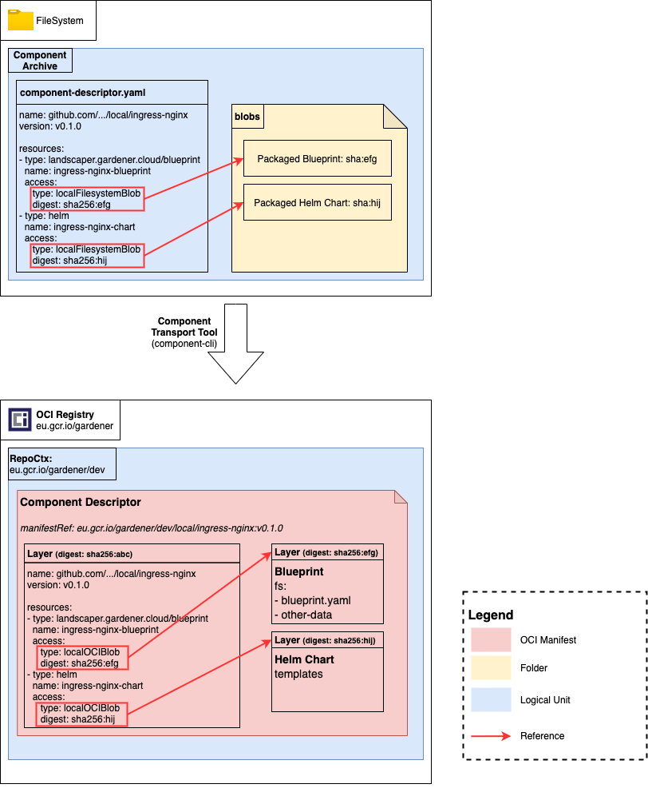

# Developing a Simple Blueprint with Local Artifacts

In the first tutorial a nginx helm chart has been deployed using a blueprint and a helm chart that have been uploaded as separate artifacts to the remote repository.

But with the component-descriptor it is also possible to have local artifacts which means that the blueprint, the helm chart and the component-descriptor are stored as one artifact. 
This simplifies the build and transport of the component as only one artifact has to be maintained.

This tutorial uses the same resources as created in the [first tutorial](./01-create-simple-blueprint.md) but now the artifacts are completely self-contained.
For detailed information see [the blueprint-installation-relationship](../concepts/InstallationBlueprintRelationship.md#2-local-oci-blob).

__Prerequisites__:
- Component-cli (see https://github.com/gardener/component-cli)
- [OPTIONAL] OCI compatible oci registry (e.g. GCR or Harbor)
- Kubernetes Cluster (better use two different clusters: one for the landscaper and one for the installation)

All example resources can be found in [./resources/local-ingress-nginx](./resources/local-ingress-nginx).
:warning: note that the repository `eu.gcr.io/gardener-project/landscaper/tutorials` is an example repository 
and has to be replaced with your own registry if you want to upload your own artifacts.
Although the artifacts are public readable so they can be used out-of-the-box without a need for your own oci registry.

Structure:

1. [Define Component Descriptor](#step-1-define-the-component-descriptor)
1. [Add Helm Chart](#step-2-add-helm-chart-as-local-resource-to-the-component-descriptor)
1. [Create Blueprint](#create-blueprint)
1. [Render and Validate](#render-and-validate-locally)
1. [Remote Upload](#remote-upload)
1. [Installation](#installation)
- [Summary](#summary)
- [Up next](#up-next)

### Step 1: Define the Component Descriptor

A component descriptor contains all resources that are used by the application installation.
In this example the ingress-nginx helm chart is such a resource. Other valid resources could be an `oci image` or even `node modules`.

For more information about the component descriptor and the usage of the different fields see the [component descriptor docs](https://github.com/gardener/component-spec).

```yaml
meta:
  schemaVersion: v2

component:
  name: github.com/gardener/landscaper/local/nginx-ingress
  version: v0.2.0

  provider: internal
  sources: []
  componentReferences: []
  resources: []
```

The basic component ist defined, so now the artifacts that are needed for the deployment (helm chart and blueprints) are added to the component descriptor as resources and uploaded to the oci registry.

### Step 2: Add helm chart as local resource to the component descriptor

Local resources can be added to the component descriptor by using the `component-cli`.
See the [component-cli](https://github.com/gardener/component-cli) docs for more information.

For this step, the nginx ingress helm chart downloaded as part of the first tutorial is used again.
Expand the following details section for the download instructions. (Also the example chart in the resources folder can be used)
<details>

```
helm repo add ingress-nginx https://kubernetes.github.io/ingress-nginx
helm repo add stable https://charts.helm.sh/stable
helm repo update

# download the nginx ingress helm chart and extract it to /tmp/chart/nginx-ingress
helm pull ingress-nginx/ingress-nginx --untar --destination /tmp/chart
```

</details>

The helm chart is now downloaded and stored on the machine.
Then the resource that should be added to component descriptor has to be defined in a `helm-resource.yaml` configuration file.
This configuration file contains a resource definition which takes the previously created helm char as `input`.
:warning: Note that the paths used in this configuration file are relative to the location of the `helm-resource.yaml`-file.
:information_source: The `resources.yaml` can be a multidoc yaml see section `9.2` in the [yaml spec](https://yaml.org/spec/1.2/spec.html#id2800132). See the [here](./resources/local-ingress-nginx/resources.yaml) for an example.
```yaml
---
type: helm
name: ingress-nginx-chart
version: v0.1.0
relation: external
input:
  type: "dir" # type dir automatically creates a tar from the given dir.
  path: /tmp/chart # parent path to the downloaded helm chart
  compress: true # compresses the tar/blob using gzip.
  # Media type automatically defaults to "application/gzip" for compressed=true
  # mediaType: "application/gzip"
...
```

:warning: In the above example, the path to the helm chart points to the parent directory of `/tmp/chart/nginx-ingress`.
The reason is that helm enforces to have the chart resources located in a parent directory.
If the fully qualified path to the helm chart should be used, the option `preserveDir` has to be set to `true`.
```yaml
---
type: helm
name: ingress-nginx-chart
version: v0.1.0
relation: external
input:
  type: "dir" # type dir automatically creates a tar from the given dir.
  path: /tmp/chart/nginx-ingress # fully qualified path to the downloaded helm chart
  compress: true # compresses the tar/blob using gzip.
  preserveDir: true # preserves the root directory of the helm chart
  # Media type automatically defaults to "application/gzip" for compressed=true
  # mediaType: "application/gzip"
...
```

Add the resource to the component descriptor with the component-cli:
```
landscaper-cli component-cli ca resources add ./docs/tutorials/resources/local-ingress-nginx \
  ./docs/tutorials/resources/local-ingress-nginx/helm-resource.yaml
```
:warning: Note that the directory `./docs/tutorials/resources/local-ingress-nginx` _MUST_ contain the component descriptor at `./docs/tutorials/resources/local-ingress-nginx/component-descriptor.yaml`.

See the details for some more information about the component descriptor and the created format.
<details>
This command creates a component descriptor in CTF ([Common Transport Format](https://gardener.github.io/component-spec/oci.html#cnudie-transport-format)) which is the common format that is used to describe component-descriptors and their local artifacts.
A CTF is of the following form
```yaml
├── component-descriptor.yaml
├── blobs
│   ├── sha256:someblob
│   ├── sha256:someotherblob
```

</details>

With the command above, the helm resource defined in the `helm-resource.yaml` has been added to the component descriptor as `localFilesystemBlob` and the defined input files/directories are packaged and copied to the blobs directory, which contains now 1 file.

```yaml
meta:
  schemaVersion: v2
component:
  name: github.com/gardener/landscaper/local/ingress-nginx
  version: v0.2.0
  provider: internal
  repositoryContexts:
  - baseUrl: eu.gcr.io/gardener-project/landscaper/tutorials/components
    type: ociRegistry
  componentReferences: []
  sources: []
  resources:
  - access:
      filename: sha256:a489ebe19c3670a921c3e098526baf09b44bd1bf02424e9eb52f192efc1a4760
      mediaType: application/gzip
      type: localFilesystemBlob
    name: ingress-nginx-chart
    relation: external
    type: helm
    version: v0.1.0
```

### Step 3: Create the Blueprint and add it as local artifact

The artifact that should be deployed is now part of the component descriptor and can be consumed by the blueprint.

The blueprint of the previous tutorial is reused. Check it out for more details.
As the location of the helm chart has changed from an independent artifact to a local oci blob, also the reference to the helm chart in the blueprint has to be adjusted.

Therefore, the chart is now defined as `fromResource` which takes the current copmponent descriptor reference and the name of the resource. 
```
apiVersion: landscaper.gardener.cloud/v1alpha1
kind: Blueprint

# ...

deployExecutions:
- name: default
  type: GoTemplate
  template: |
    deployItems:
    - name: deploy
      type: landscaper.gardener.cloud/helm
      target:
        import: cluster
      # ...
      config:
        apiVersion: helm.deployer.landscaper.gardener.cloud/v1alpha1
        kind: ProviderConfiguration

        chart:
          fromResource: # will fetch the helm chart from component descriptor resource of type helm chart
    {{ toYaml .componentDescriptorDef | indent 8 }}
            resourceName: ingress-nginx-chart

# ...
```

When the blueprint has been created it is also defined as resource in a `blueprint-resource.yaml` configuration file.
This configuration file contains the resource definition with the input to the previously created blueprint.
```yaml
---
type: blueprint
name: ingress-nginx-blueprint
relation: local
input:
  type: "dir" # creates a tar from the given directory
  path: ./blueprint
  # overwrites the media for the resource. Default for tar/gzip is "application/gzip"
  mediaType: "application/vnd.gardener.landscaper.blueprint.v1+tar+gzip"
  compress: true # compresses the tar using gzip
...
```

```
landscaper-cli component-cli ca resources add ./docs/tutorials/resources/local-ingress-nginx \
  ./docs/tutorials/resources/local-ingress-nginx/blueprint-resource.yaml
```

With his, the blueprint has been added to the component descriptor as `localFilesystemBlob` and the content has been packaged and copied to the blobs directory, which contains now 2 files.

```yaml
meta:
  schemaVersion: v2
component:
  name: github.com/gardener/landscaper/local/ingress-nginx
  version: v0.2.0
  provider: internal
  repositoryContexts:
  - baseUrl: eu.gcr.io/gardener-project/landscaper/tutorials/components
    type: ociRegistry
  componentReferences: []
  sources: []
  resources:
  - access:
      filename: sha256:5c93619f745ff4b5352cd10957f6da7effd76ddfc2c4f612619080c09bcb2d49
      mediaType: application/vnd.gardener.landscaper.blueprint.v1+tar+gzip
      type: localFilesystemBlob
    name: ingress-nginx-blueprint
    relation: local
    type: blueprint
    version: v0.2.0
  - access:
      filename: sha256:a489ebe19c3670a921c3e098526baf09b44bd1bf02424e9eb52f192efc1a4760
      mediaType: application/gzip
      type: localFilesystemBlob
    name: ingress-nginx-chart
    relation: external
    type: helm
    version: v0.1.0
```

### Step 4: Upload the Component Descriptor

Upload the component and its local artifacts with the `component-cli`:
```
landscaper-cli component-cli ca remote push ./docs/tutorials/resources/local-ingress-nginx
```
:warning: make sure to have write permissions for the component registry. (Run `docker login registry` to login into the registry)

During the upload the `localFilesystemBlob` are converted to `localOciBlob` as they are now part of the component descriptor in the oci registry.



:information_source: The uploaded component descriptor can be checked by running
```
landscaper-cli component-cli ca remote get eu.gcr.io/gardener-project/landscaper/tutorials/components github.com/gardener/landscaper/local/ingress-nginx v0.2.0
```

```yaml
meta:
  schemaVersion: v2
component:
  name: github.com/gardener/landscaper/local/ingress-nginx
  version: v0.2.0
  provider: internal
  repositoryContexts:
  - baseUrl: eu.gcr.io/gardener-project/landscaper/tutorials/components
    type: ociRegistry
  sources: []
  componentReferences: []
  resources:
  - access:
      digest: sha256:5c93619f745ff4b5352cd10957f6da7effd76ddfc2c4f612619080c09bcb2d49
      type: localOciBlob
    name: ingress-nginx-blueprint
    relation: local
    type: blueprint
    version: v0.2.0
  - access:
      digest: sha256:a489ebe19c3670a921c3e098526baf09b44bd1bf02424e9eb52f192efc1a4760
      type: localOciBlob
    name: ingress-nginx-chart
    relation: external
    type: helm
    version: v0.2.0
```

### Installation

As all external resources are defined and uploaded, the nginx ingress can be installed into the second kubernetes cluster.

Now everything can be installed as [described in before](./01-create-simple-blueprint.md#Installation).

### Summary
- A Component Descriptor has been created that contains the Blueprint and another external resources as resources.
- The Component Descriptor, the blueprint and the helm are uploaded to the OCI registry.
- An _Installation_ has been defined and applied to the cluster which resulted in the deployed nginx application.

## Up Next
In the [next tutorial](./03-simple-import.md), another application is deployed that used the exported ingressClass data.
