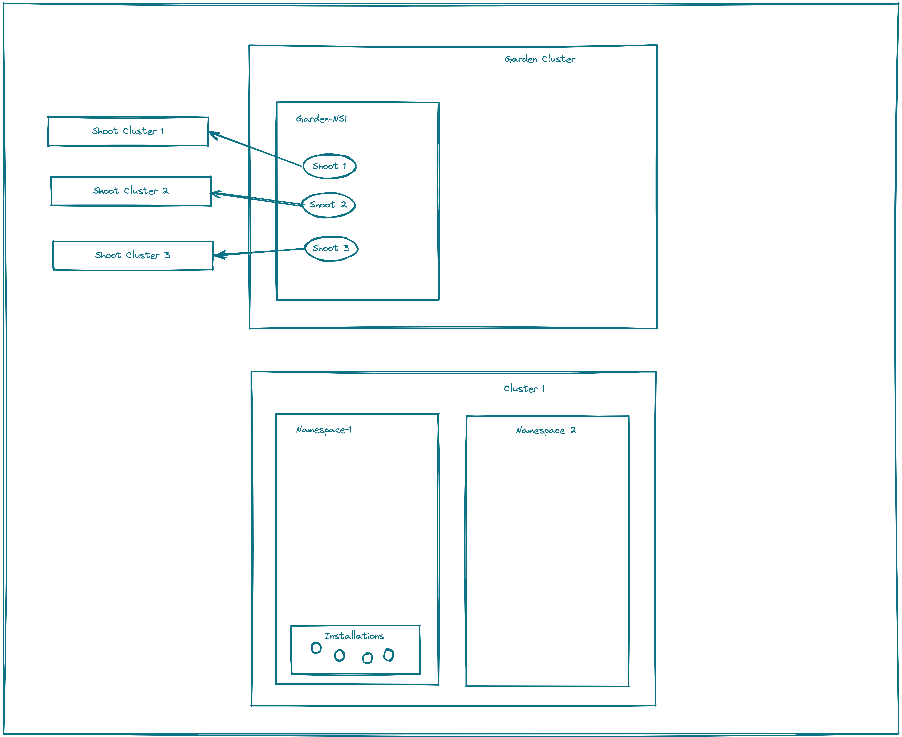
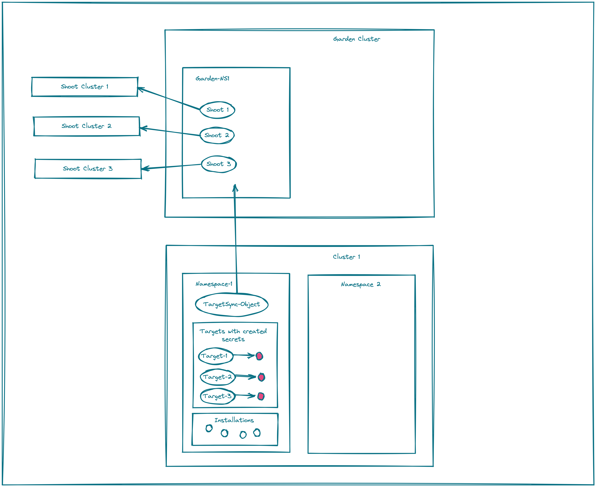
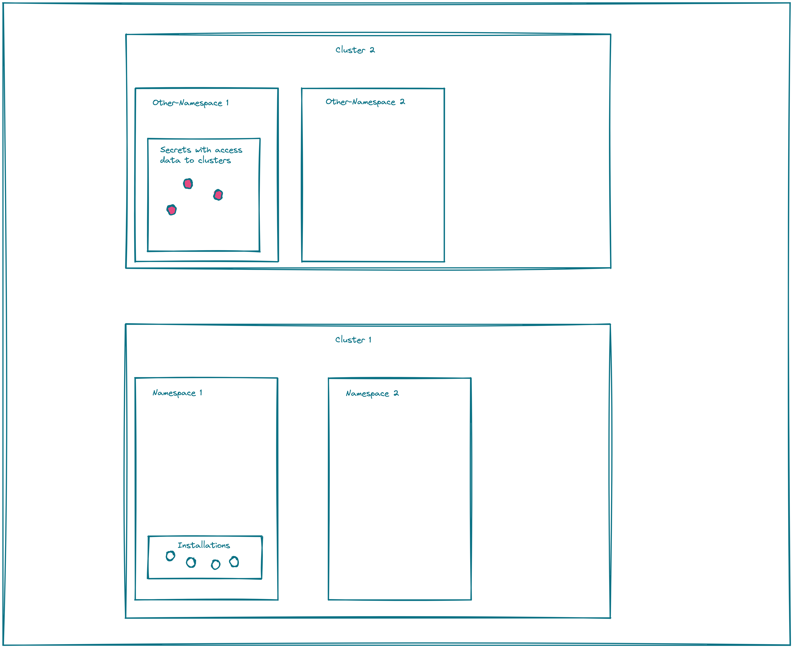

# TargetSync Objects 

This chapter describes the custom resource *TargetSync*. With such a *TargetSync* object, it is possible to 
automatically create `Targets` of type *landscaper.gardener.cloud/kubernetes-cluster*. Two variants are supported:

- The targets are created and regularly rotated using the Gardener adminkubeconfig resource requests 
  ([see](https://github.com/gardener/gardener/blob/master/docs/usage/shoot_access.md)). Note that this approach only works for target shoot clusters which are managed by Gardener. Thereby, the shoot clusters do not require static access token.
  This is the preferred approach if you are working with Gardener shoot clusters.

- The targets are created from secrets containing the access data to a shoot cluster.

## Targets created using adminkubeconfig resource requests

Imagine a setup as shown in the picture below. `Cluster 1` contains all installation CRs, which should be watched and processed by the Landscaper. Cluster 1 is the so-called *Landscaper Resource Cluster*.
In the `Garden Cluster`, every namespace is associated with a Garden project, in which a set of shoot clusters exists.



The goal is to create a target CR in *Namespace-1* of *cluster 1* for every shoot cluster in the Garden project *Garden-NS1*. These targets could then be used or referenced by the Landscaper installations created in *cluster 1*.

This can be achieved by creating a *TargetSync* CR in *Namespace-1* of *cluster 1*, containing the right 
settings. This situation is depicted here: 



The names of the newly created targets and the corresponding shoot clusters will be the same, to easily see the relations of targets to shoot clusters.

The credentials stored in the targets (or better: in their referenced secrets) are rotated regularly by the Landscaper.

Note that only one *TargetSync* object is allowed per namespace in cluster 1. If you create more than one *TargetSync* object for a namespace, the Landscaper stops synchronizing secrets for this namespace as long as this situation is not resolved.

A *TargetSync* object looks as follows:

```yaml
apiVersion: landscaper.gardener.cloud/v1alpha1
kind: TargetSync
metadata:
  name: <some name>
  namespace: <Namespace 1>
spec:
  sourceNamespace: <Garden Project Namespace>
  shootNameExpression: <some regex e.g. "*">
  secretRef:
    key: <some key>
    name: <some secret name>
  tokenRotation: # optional
    enabled: true/false
```

The entries of such a *TargetSync* object have the following meaning:

- sourceNamespace: The Garden project namespace.
- shootNameExpression: A regular expression restricting the synchronized shoots to only those having a name matching this expression. For example the regular expression `"test$"` considers only shoots with a name having the suffix `test`. The syntax is according to *https://github.com/google/re2/wiki/Syntax* with the extension that "*" is also a valid expression that matches all names. If empty nothing matches.
- secretRef: A reference to a secret in the same namespace as the *TargetSync* object, containing a kubeconfig.yaml in its data section under the specified *key*. This kubeconfig must provide access to the Garden project namespace. This secret must be created together with the *TargetSync* object.
- tokenRotation: Will be explained further below.

An example demonstrating how to create a *TargetSync* object to create targets for shoot clusters can be found
[here](https://github.com/gardener/landscaper-examples/tree/master/sync-targets/example2).

## Targets created from Secrets

Imagine a situation as shown in the following picture. In the namespaces of cluster 1, the Landscaper 
installation CRs are stored. In the namespaces of cluster 2, there are secrets containing the access information to some k8s clusters. An example for cluster 2 is the typical setup of a [Gardener instance](https://gardener.cloud/), where the access data to the shoot clusters of a project are stored in static secrets with names `<clustername>.kubeconfig` in the
namespaces `garden-<projectname>` on the Garden cluster.



Now, the goal is to automatically create targets for the secrets in cluster 2 in the namespaces of cluster 1, which could be used or referenced by the Landscaper installations created there. It is important that changes to the secrets in cluster 2 result in corresponding updates of the targets in cluster 1.

This goal can be achieved by creating a *TargetSync* object in e.g. *Namespace 1* of cluster 1. The *TargetSync* object contains the information that the Landscaper should copy the secrets from *Other-Namespace 1* in cluster 2 to *Namespace 1* in cluster 1 and creates `Targets` of type *landscaper.gardener.cloud/kubernetes-cluster* 
referencing these secrets. The names of the newly created targets are the same as the names of the corresponding secrets.

The resulting situation is depicted in the following picture:


If the secrets in *Other-Namespace 1* on cluster 2 are changed, i.e. a new secret is created,
and existing one is modified or deleted, this is synchronized to cluster 1 after at most 5 minutes and the  corresponding secrets and targets are created, updated or deleted.

Currently, it is assumed that the secrets on cluster 2 contain the access data to the clusters in an entry 
*kubeconfig* of their data section and the data itself must be a kubeconfig.yaml.

Only one *TargetSync* object is allowed per namespace in cluster 1. If you create more than one *TargetSync* object  for a namespace, the Landscaper stops synchronizing secrets for this namespace as long as this situation is not resolved.

A *TargetSync* object looks as follows:

```yaml
apiVersion: landscaper.gardener.cloud/v1alpha1
kind: TargetSync
metadata:
  name: <some name>
  namespace: <Namespace 1>
spec:
  sourceNamespace: <Other-Namespace 1>
  secretNameExpression: <some regex e.g. "\.kubeconfig$">
  secretRef:
    key: <some key>
    name: <some secret name>
  tokenRotation: # optional
    enabled: true/false
```

The entries of a *TargetSync* object have the following meaning:

- sourceNamespace: The namespace form where the secrets should be synced.
- secretNameExpression: A regular expression restricting the synchronized secrets to only those having a name matching this expression. For example the regular expression `"\.kubeconfig$"` only synchronizes secrets with a name having the suffix `.kubeconfig`. The syntax is according to *https://github.com/google/re2/wiki/Syntax* with the extension that "*" is also a valid expression that matches all names. If empty nothing matches.
- secretRef: A reference to a secret in the same namespace as the *TargetSync* object containing a kubeconfig yaml in its data section under the specified *key*. This kubeconfig must provide access to the secrets which should be synchronized. This secret must be created together with the *TargetSync* object. 
- tokenRotation: Will be explained in the next chapter.

An example how to create a *TargetSync* object could be found 
[here](https://github.com/gardener/landscaper-examples/tree/master/sync-targets/example1).

## Token Rotation

If the field `tokenRotation.enabled` is set tu `true`, the token in the kubeconfig of the secret referenced by
the *TargetSync* object in `spec.secretRef` is rotated every 60 days, whereby the lifetime of new every token is 60 days. It is assumed that the kubeconfig in the secret has the following format (this is the format if you download the kubeconfig of a Gardener service account, from the Gardener dashboard):

```yaml
apiVersion: v1
kind: Config
current-context: ...
contexts:
  - name: ...
    context:
      cluster: ...
      user: ...
      namespace: ...
clusters:
  - name: ...
    cluster:
      server: https://...
users:
  - name: <service account name>
    user:
      token: >-
        eyJhbGciOiJSUzI1NiIsImtpZCI6IjBCOXVYUkd2ck0zdC1TMVUtMXFESWRNc1BPYzR...
```

Token rotation requires that the corresponding service account is allowed to request new tokens for itself.
