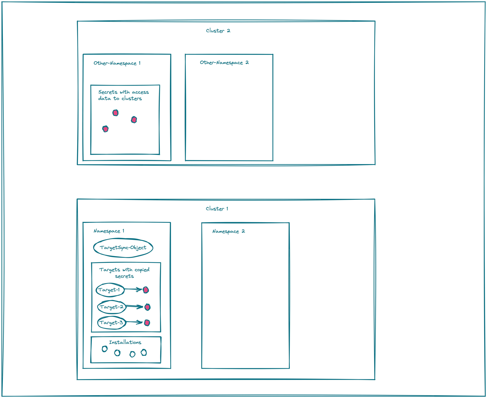

# TargetSync Objects 

This Chapter describes the custom resource *TargetSync*. With a  *TargetSync* object it is possible to 
automatically create `Targets` of type *landscaper.gardener.cloud/kubernetes-cluster* from secrets containing 
the access data to a shoot cluster.

Assume, we have the situation as described in the following picture. In the namespaces of cluster 1, the Landscaper 
installations are stored. In the namespaces of cluster 2, there are secrets containing the access information to some
k8s cluster. An example for cluster 2 is the typical setup of a [Gardener instance](https://gardener.cloud/) where 
the access data to the shoot clusters of a project are stored in secrets with name *clustername.kubeconfig* in the
namespace *garden-projectname* on the Garden cluster.


The goal is to automatically create targets from the secrets on cluster 2 in the namespaces of cluster 1 which
could be used by Landscaper installations created there. Thereby it is important that later changes of the secrets 
in cluster 2 must result in corresponding updates of the targets in cluster 1.

This goal could be achieved by creating a *TargetSync* object in *Namespace 1* of cluster 1. The *TargetSync* object 
contains the information such that the Landscaper copies the secrets from *Other-Namespace 1* in cluster 2 
to *Namespace 1* of cluster 1 and creates `Targets` of type *landscaper.gardener.cloud/kubernetes-cluster* 
referencing these secrets. The names of the newly created targets are the same as the corresponding secrets.

If a something changes with respect to the secrets  *Other-Namespace 1* on cluster 2, i.e. a new secret is created,
and existing one is modified or deleted, this is synchronized to cluster 1 after at most 5 minutes.

Currently, it is assumed, that the secrets on cluster 2 contain the access data to the clusters in an entry 
*kubeconfig* of their data section and the data itself must be a kubeconfig yaml.

At most one *TargetSync* object is allowed per namespace in cluster 1. If you create more than one for a namespace, 
the Landscaper stops synchronizing secrets for this namespace as long as this situation is not resolved.



A *TargetSync* object looks as follows:

```yaml
kind: TargetSync
metadata:
  name: <Namespace 1>
  namespace: <some name>
spec:
  sourceNamespace: <Other-Namespace 1>
  secretNameExpression: <some regex e.g. "\.kubeconfig$">
  secretRef:
    key: <some key>
    name: example-target-sync
```

The entries of a *TargetSync* object have the following meaning:

- sourceNamespace: The namespace form where the secrets should be synced.
- secretNameExpression: A regular expression restricting the synchronized secrets to only those having a name
  matching this expression. For example the regular expression `"\.kubeconfig$"` only synchronizes secrets with a 
  name having the suffix `.kubeconfig`.
- secretRef: A reference to a secret in the same namespace as the *TargetSync* object containing a kubeconfig 
  yaml in its data section under the specified *key*. This kubeconfig must provide access to the secrets which 
  should be synchronized. This secrets must be created together with the *TargetSync* object. 

An example how to create a *TargetSync* object could be found 
[here](https://github.com/gardener/landscaper-examples/tree/master/sync-targets).


