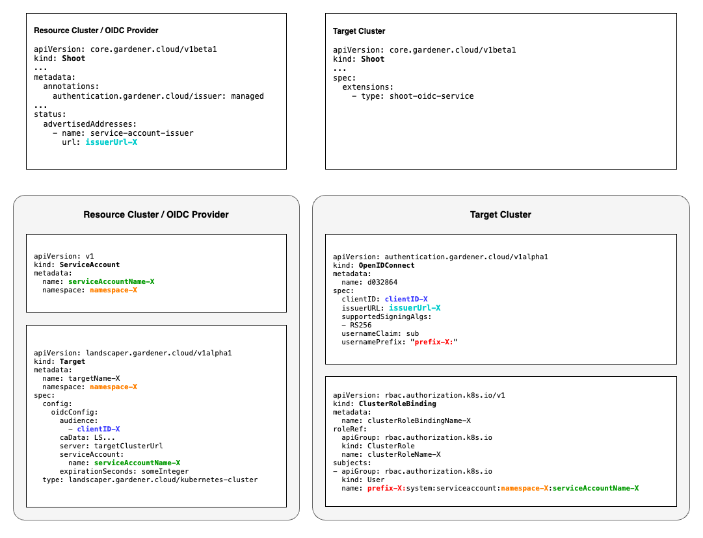

# Targets

## Definition

Targets are a specific type of import and contain additional information that is interpreted by deployers.
The concept of a Target is to define the environment where a deployer installs/deploys software.
This means that targets could contain additional information about that environment (e.g. that the target cluster is in 
a fenced environment and needs to be handled by another deployer instance).

The configuration structure of targets is defined by their type (currently the type is only for identification but later 
we plan to add some type registration with checks.)

## Inline Configuration vs. Secret Reference

The content of a Target can be provided in two different ways: either inline in the Target, or as a reference to a secret containing the actual value.

All of the example Targets given below result in the same Target content.

### Inline Configuration

The easiest way is to just put the configuration inline into the Target's `config` field:

```yaml
apiVersion: landscaper.gardener.cloud/v1alpha1
kind: Target
metadata:
  name: my-cluster
spec:
  type: landscaper.gardener.cloud/kubernetes-cluster
  config:
    kubeconfig: |
      apiVersion: v1
      clusters:
      - cluster:
          certificate-authority-data: ...
          server: https://my-apiserver.example.com
        name: default
      contexts:
      - context:
          cluster: default
          user: default
        name: default
      current-context: default
      kind: Config
      preferences: {}
      users:
      - name: default
        user:
          token: ...
```

### Secret Reference

Alternatively, the Target can also reference a secret containing the actual value instead:

Secret:
```yaml
apiVersion: v1
kind: Secret
metadata:
  name: cluster-access
type: Opaque
data:
  kubeconfig: |
    YXBpVmVyc2lvbjogdjEKY2x1c3RlcnM6Ci0gY2x1c3RlcjoKICAgIGNlcnRpZmljYXRlLWF1dGhvcml0eS1kYXRhOiAuLi4KICAgIHNlcnZlcjogaHR0cHM6Ly9teS1hcGlzZXJ2ZXIuZXhhbXBsZS5jb20KICBuYW1lOiBkZWZhdWx0CmNvbnRleHRzOgotIGNvbnRleHQ6CiAgICBjbHVzdGVyOiBkZWZhdWx0CiAgICB1c2VyOiBkZWZhdWx0CiAgbmFtZTogZGVmYXVsdApjdXJyZW50LWNvbnRleHQ6IGRlZmF1bHQKa2luZDogQ29uZmlnCnByZWZlcmVuY2VzOiB7fQp1c2VyczoKLSBuYW1lOiBkZWZhdWx0CiAgdXNlcjoKICAgIHRva2VuOiAuLi4K
  # decoded value for convenience:
    # apiVersion: v1
    # clusters:
    # - cluster:
    #     certificate-authority-data: ...
    #     server: https://my-apiserver.example.com
    #   name: default
    # contexts:
    # - context:
    #     cluster: default
    #     user: default
    #   name: default
    # current-context: default
    # kind: Config
    # preferences: {}
    # users:
    # - name: default
    #   user:
    #     token: ...

```

Target:
```yaml
apiVersion: landscaper.gardener.cloud/v1alpha1
kind: Target
metadata:
  name: my-cluster
spec:
  type: landscaper.gardener.cloud/kubernetes-cluster
  secretRef:
    name: cluster-access
```

Targets can only reference secrets in their own namespace.

It is also possible to not reference a complete secret - in which case the complete structure from its `data` field will be interpreted as the Target's content - but only the value of a specific key. To do so, add the `key` to the secret reference:

Secret:
```yaml
apiVersion: v1
kind: Secret
metadata:
  name: cluster-access
type: Opaque
data:
  cluster1: |
    a3ViZWNvbmZpZzogfAogIGFwaVZlcnNpb246IHYxCiAgY2x1c3RlcnM6CiAgLSBjbHVzdGVyOgogICAgICBjZXJ0aWZpY2F0ZS1hdXRob3JpdHktZGF0YTogLi4uCiAgICAgIHNlcnZlcjogaHR0cHM6Ly9teS1hcGlzZXJ2ZXIuZXhhbXBsZS5jb20KICAgIG5hbWU6IGRlZmF1bHQKICBjb250ZXh0czoKICAtIGNvbnRleHQ6CiAgICAgIGNsdXN0ZXI6IGRlZmF1bHQKICAgICAgdXNlcjogZGVmYXVsdAogICAgbmFtZTogZGVmYXVsdAogIGN1cnJlbnQtY29udGV4dDogZGVmYXVsdAogIGtpbmQ6IENvbmZpZwogIHByZWZlcmVuY2VzOiB7fQogIHVzZXJzOgogIC0gbmFtZTogZGVmYXVsdAogICAgdXNlcjoKICAgICAgdG9rZW46IC4uLgo=
  # decoded value for convenience:
    # kubeconfig: |
    #   apiVersion: v1
    #   clusters:
    #   - cluster:
    #       certificate-authority-data: ...
    #       server: https://my-apiserver.example.com
    #     name: default
    #   contexts:
    #   - context:
    #       cluster: default
    #       user: default
    #     name: default
    #   current-context: default
    #   kind: Config
    #   preferences: {}
    #   users:
    #   - name: default
    #     user:
    #       token: ...
```

Target:
```yaml
apiVersion: landscaper.gardener.cloud/v1alpha1
kind: Target
metadata:
  name: my-cluster
spec:
  type: landscaper.gardener.cloud/kubernetes-cluster
  secretRef:
    name: cluster-access
    key: cluster1
```

Note that the value of `cluster1` in the secret now not only contains the kubeconfig, but a struct with a `kubeconfig` key instead.


#### Resolving Secret References

The deployers have to take care of resolving secret references in Targets. If the deployer library is used, this is handled by the library and the functions which have to be implemented by the deployer get the already resolved Target in form of a [ResolvedTarget](../api-reference/core.md#resolvedtarget) struct. This struct has a `Content` field which contains the content of the Target, independently of whether it was specified inline or via a reference in the Target.

If you write your own deployer without using the deployer library, you will have to take care of resolving secret references in Targets yourself.

## OIDC Target to Kubernetes Target Cluster

Instead of storing credentials in Targets or Secrets to get access to a target cluster it is possible to configure
a trust relationship between the target cluster (where you want to install your software) and the resource cluster
(where the Landscaper Installations and Targets resides). This allows to use OIDC Targets which do not require
any credentials to be stored somewhere. 

In the following we show how to set up such a trust relationship and create OIDC Targets. The description assumes that
both, the target and the resource cluster are [Gardener shoot clusters](https://gardener.cloud/). 

To configure a trust relationship between a target cluster with Name `target-x` and a resource cluster `resource-x`
you need the following preparation steps:

- Configure the resource shoot cluster as a 
    [managed service account issuer](https://gardener.cloud/docs/gardener/shoot_serviceaccounts/#managed-service-account-issuer) 
    by adding the following annotation to its shoot specification:
  ```yaml
  annotations:
    authentication.gardener.cloud/issuer: managed
  ```

- In the target shoot cluster, enable the `shoot-oidc-service` extension 
  ([see](https://gardener.cloud/docs/extensions/others/gardener-extension-shoot-oidc-service/openidconnects/)) by
  adding the following to the shoot specification:
  ```yaml
  spec:
    extensions:
      - type: shoot-oidc-service
  ```
  
Both cluster must be reconciled after the modifications.
  
After these cluster preparation steps, you can now configure the trust between the target and the resource cluster by
creating an OpenIDConnect resource on the target cluster

```yaml
apiVersion: authentication.gardener.cloud/v1alpha1
kind: OpenIDConnect
metadata:
  name: <someName>

spec:
  clientID: <someID> # e.g. name of the resource cluster resource-x
  issuerURL: <issuerUrl>
  supportedSigningAlgs:
  - RS256
  usernameClaim: sub
  usernamePrefix: <somePrefix> # e.g. pre-resource-x
```

After the former modification and a reconciliation of the resource cluster you find the `issuerURL` of the resource cluster in
the status of its shoot yaml with the following command:
  ```bash
  kubectl -n my-project get shoot resource-x -o jsonpath='{.status.advertisedAddresses[?(@.name=="service-account-issuer")].url}'
  ```

On the resource cluster you define a Service Account like the following:

```yaml
apiVersion: v1

kind: ServiceAccount
metadata:
  name: <someName> # e.g. test-service-account
  namespace: <someNamespace> # e.g. ls-user
```

On the target cluster (not the resource cluster!) you define the cluster role binding (and cluster roles) for this
service account on the resource cluster, e.g. as follows:

```yaml
kind: ClusterRoleBinding
metadata:
  name: <someName>

roleRef:
  apiGroup: rbac.authorization.k8s.io
  kind: ClusterRole
  name: <some clusterRole> # e.g. cluster-admin, which is the predefined role usually required to deploy something to the target cluster

subjects:
- apiGroup: rbac.authorization.k8s.io
  kind: User
  name: <prefix defined in OpenIDConnect resource>:system:serviceaccount:<namespace of service account>:<name of service account>
```

If required, instead of a ClusterRoleBinding you could also define a RoleBinding.

And now it is time to define an OIDC target on the resource cluster with:

```yaml
apiVersion: landscaper.gardener.cloud/v1alpha1

kind: Target
metadata:
  name: <targetName>
  namespace: <targetNamespace>

spec:
  config:
    audience:
    - <clientID of OpenIDConnect on the target cluster>
    caData: LS... # ca data of the target cluster
    server: <ApiServerUrl of the target cluster> # https://api.<clusterName>...
    serviceAccount: 
      name: <name of Service Account>
      namespace: <namespace of Service Account> # might be different from the Target namespace
    expirationSeconds: <some integer> # defaults to 86400 = 60 * 60 * 24, if not set
  type: landscaper.gardener.cloud/kubernetes-cluster
```

This target can be used in Landscaper Installations as other Targets of this type with credentials. 

The following picture gives an overview about the cluster settings and k8s resources required to set up a 
trust relationship between the resource and the target cluster.

