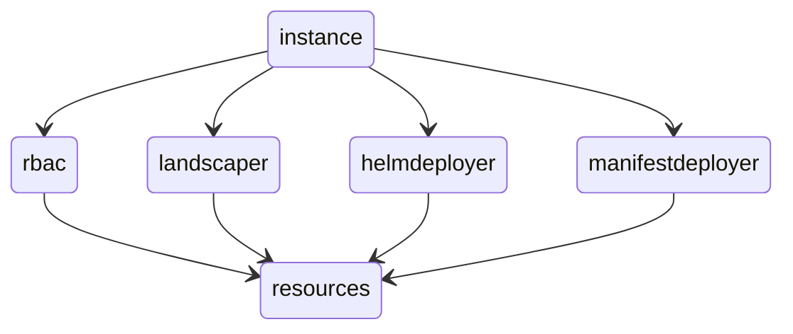

# Landscaper Installer

- [ ] Configuration secret
- [ ] Checksums


- [ ] Prevent nilpointer: values.WebhooksServer.LandscaperClusterKubeconfig.Kubeconfig

## RBAC Component

## Landscaper Component

- [ ] Test
- [ ] Config Secret


## Landscaper Webhooks

The instances use `automountServiceAccountToken: false` in the webhooks pod template. 
This is because the service account token is not needed for the webhooks. The service account token is mounted in the 
landscaper pod template.

The webhooks pod template of the core landscaper on the other hand, has a serviceAccountName set.


## Components

- manifest-deployer
- helm-deployer
- landscaper-rbac
- landscaper-controller
- landscaper-controller-main
- landscaper-webhooks-server


## Package Dependencies




Landscaper

```yaml
        global:
          serviceAccount:
            controller:
              create: true
              annotations: {}
              name: landscaper-{{ .imports.hostingClusterNamespace }}
            webhooksServer:
              name: landscaper-webhooks
```

RBAC

```yaml
        global:
          serviceAccount:
            controller:
              create: true
              annotations: {}
              name: landscaper-controller

            webhooksServer:
              create: true
              annotations: {}
              name: landscaper-webhooks

            user:
              create: true
              annotations: {}
              name: landscaper-user
```

On the resource cluster, we create three service accounts: user, controller, webhooks. 

- The user service account is used by the landscaper user to interact with the resource cluster.
How does an MCP user get the roles to act on Landscaper resources? Does MCP know about the Landscaper resources (CRDs)?

- The controller service account is used by the landscaper controller to interact with the resource cluster.
- The webhooks service account is used by the landscaper webhooks server to interact with the resource cluster.

In the Landscaper RBSC Chart, there are aggregated cluster roles. For what?

In the MCP scenario, do we still create service accounts on the resource cluster, and tokens, and pass them to the Landscaper controller on the host/workload cluster?
Is OIDC used?


