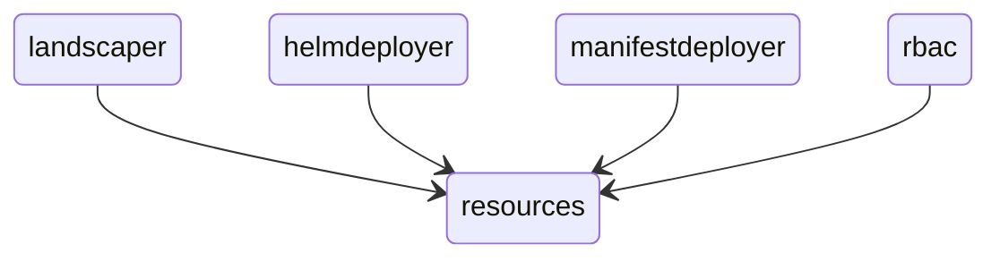

# Landscaper Installer

- [ ] Finish deployments of the landscaper component (main and central): labels and annotations
- [ ] Webhooks deployment
- [ ] Configuration secret
- [ ] Volume/mount for registry pull secrets
- [ ] Shared package for functions that are the same for the main and central deployment; or methods at the values helper?

- [ ] Check oci configuration of the helm deployer; check volume mount: where is the mount path "/app/ls/registry/secrets" used?

- [ ] Prevent nilpointer: values.WebhooksServer.LandscaperClusterKubeconfig.Kubeconfig

## RBAC Component

- [ ] Test

## Landscaper Component

- [ ] Test
- [ ] Labels for component and topology
- [ ] Config Secret
- [ ] Value helper: functions `selectorLabels`, `mainSelectorLabels`, `podAnnotations`

## Package Dependencies

```mermaid
stateDiagram-v2
    landscaper --> resources
    helmdeployer --> resources
    manifestdeployer --> resources
    rbac --> resources
```