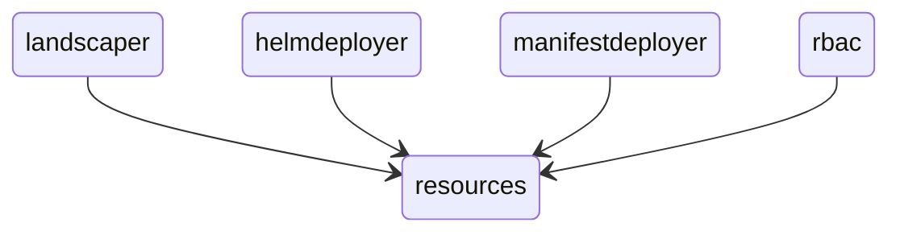

# Landscaper Installer

- [ ] Finish deployments of the landscaper component (main and central): labels and annotations
- [ ] Configuration secret
- [ ] Volume/mount for registry pull secrets

- [ ] Check oci configuration of the helm deployer; check volume mount: where is the mount path "/app/ls/registry/secrets" used?

- [ ] Prevent nilpointer: values.WebhooksServer.LandscaperClusterKubeconfig.Kubeconfig

## RBAC Component

- [ ] Test

## Landscaper Component

- [ ] Test
- [ ] Labels for component and topology
- [ ] Config Secret
- [ ] Value helper: functions `selectorLabels`, `mainSelectorLabels`, `podAnnotations`

## Landscaper Webhooks

The instances use `automountServiceAccountToken: false` in the webhooks pod template. 
This is because the service account token is not needed for the webhooks. The service account token is mounted in the 
landscaper pod template.

The webhooks pod template of the core landscaper on the other hand, has a serviceAccountName set.

## Components

- manifest-deployer
- helm-deployer
- landscaper-rbac
- landscaper-controller
- landscaper-controller-main
- landscaper-webhooks-server

## Package Dependencies

```mermaid
stateDiagram-v2
    landscaper --> resources
    helmdeployer --> resources
    manifestdeployer --> resources
    rbac --> resources
```