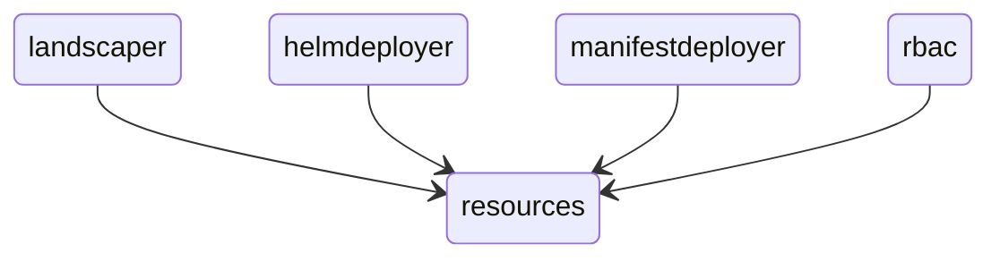

# Landscaper Installer

- [ ] Check oci configuration of the helm deployer; check volume mount: where is the mount path "/app/ls/registry/secrets" used?

## Package Dependencies

```mermaid
stateDiagram-v2
    landscaper --> resources
    helmdeployer --> resources
    manifestdeployer --> resources
    rbac --> resources
```