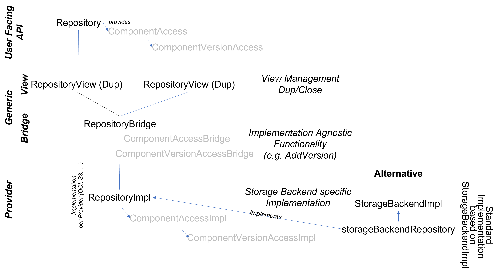

# Context Programming Interface for Repositories

Package repocpi contains the implementation support
 for repository backends. It offers three methods
 to create component version, component and repository
 objects based on three simple implementation interfaces.
 
 The basic provisioning model is layered:

 

   - on layer 1 there is the *user facing API* defined
     in package [github.com/open-component-model/ocm/pkg/contexts/ocm].

   - on layer 2 (this package) there is a backend agnostic
     implementation of standard functionality based on layer 3.
     This is divided into two parts

     a) the *view* objects provided by the `Dup()` calls of the layer 1 API.
     All dups are internally based on a single base object.
     These objects are called *bridge*. They act as base object
     for the views and as abstraction for the implementation objects
     providing *generic* implementations potentially based on
     the implementation functionality.
     (see bridge design pattern https://refactoring.guru/design-patterns/bridge)

     b) the *bridge*  object as base for all dup views is used to implement some
     common functionality like the view management. The bridge object
     is closed, when the last view disappears.
     This bridge object then calls the final
     storage backend implementation interface.

   - the storage backend implementations based on the implementation
     interfaces provided by layer 2.

 The implementation interfaces and the functions to create API objects are:

   - interface [ComponentVersionAccessImpl] is used to create an ocm.ComponentVersionAccess object
     using the function [NewComponentVersionAccess].
   - interface [ComponentAccessImpl] is used to create an ocm.ComponentAccess object
     using the function [NewComponentAccess].
   - interface [RepositoryImpl] is used to create an ocm.ComponentAccess object
     using the function [NewRepository].

 Component version implementations provide basic access to component versions
 and their descriptors. They keep a reference to component implementations, which are
 again based on repository implementations. The task of repository implementations is
 to provide component objects. Their implementations are responsible to provide
 component version objects.

## Simplified Respository Implementation Interface
 Besides this basic implementation interfaces with separated objects for a
 repository, component and component version, there is support for a simplified
 implementation interface (`StorageBackendImpl`). This is a single interface
 bundling all required functionality to implement the objects for the three
 concerned elements. With `NewStorageBackend` it is possible to instantiate
 a new kind of repository based on this single interface. The required
 objects for components and component versions are generically provided
 based on the methods provided by this interface.
 
## Comparison of Implementation Models

The simplified implementation model does not provide access to the
implementation objects for components and component versions.
Therefore, it is not possible to keep state for those elements.

Storage Backend Implementations requiring such state, like the OCI 
implementation based on the OCI abstraction provided by the OCI
context, therefore use dedicated implementations for repository,
component and component version objects. This model provides
complete control over the lifecycle of those elements.

If a storage backend implementation is stateless or just keeps
state at the repository level, the simplified implementation model
can be chosen.

